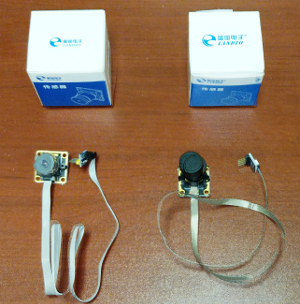

# Camera Module

We have discovered there are two different CCD modules being shipped.

Each camera has an end connector that ends up in a 5 pin 0.100" header. unfortunately this 5 pin connector is not used on the new boards.

## Version 1

One version of the camera has an adapter board at the end of the cable which can be removed. When removed, the cable end fits correctly on the **CCD1 header**

.

## Version 2

The second version uses flat flex cable and the adapter to the 5 pin header does not come apart.

This version has the correct signals on the 5 pin 0.100" connector, but does not fits the **CCD1 header**.

### Version 2 problem resolution

In order to correct this problem a small adapter board has been prepared. **LZCAMADAPT2** is the correct board to allow the 5 pin header to adapt to the 10 pin CCD1 header.

NOTE: \*I\* was rushing and made a dumb mistake on the first board **LZCAMADAPT. This is corrected in LZCAMADAPT2.**

* [x] Build small adapter board (LZCAMADAPT2)
* [ ] Order/replace Version 2 CCD with V1 assuming they are available and can arrive quickly (They are not able to be delivered quickly.
