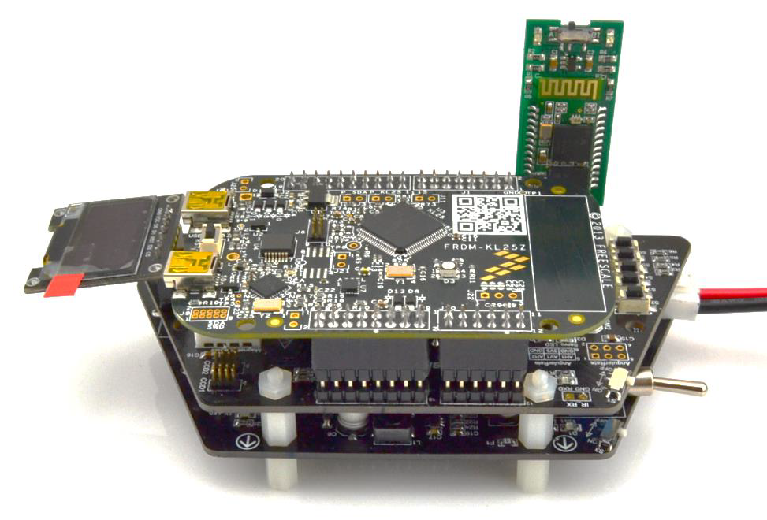

# LCD Module

Please note that the LCD module was **not intended to ship with the 2017/18 model kits**. So consider it a "Free bonus" part

## However we have had a couple of questions:

Q: is there software to run the LCD module?

A: Sorry, no. We didn't intend on it to ship with the kits.

Q: The LCD module is not physically supported on the frame

A: That is correct. From the Landzo documentation (see picture below, we see that it just hangs over the edge of the PCB.

* [ ] \<ToDo: Look at what would be needed to provide a support bracket that could be 3D printable using an FDM printer and post to thingiverse.>&#x20;
