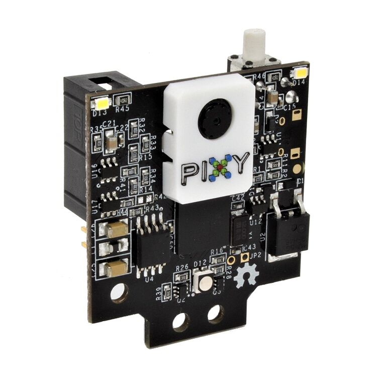
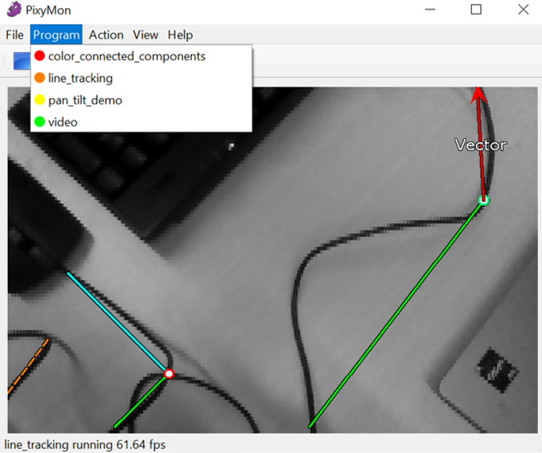

# Configuring the PixyCam


This page is under construction. The purpose is to ensure the PixyCAM is correctly configured for line following mode, which is also used in NXP-CUP. Last updated 07/07/2023


## Using Pixy2 with PX4

The pixy2 camera is a computer-aided visual recognition system used in NXP Cup to create a line-following robot. It can also be trained to detect colored objects.&#x20;

<figure><figcaption></figcaption></figure>

### Configuring the camera

To start working with the camera you first need to configure it. Download and install [Pixymon v2](https://pixycam.com/downloads-pixy2/) then connect your camera to your computer using USB.

The camera communication interface has to be configured first. Follow this [guide ](https://docs.pixycam.com/wiki/doku.php?id=wiki:v2:porting\_guide)for more information.

Open Pixymon v2. In the "Program" tab you can choose different modes. As default there are four different modes to choose from:

* _color connected components or CCC: a_ color-based filtering algorithm. you can teach the camera what you are interested in sensing (more information [here](https://docs.pixycam.com/wiki/doku.php?id=wiki:v2:color\_connected\_components))
* _line tracking: detect and track line (more information_ [_here_](https://docs.pixycam.com/wiki/doku.php?id=wiki:v2:line\_tracking)_)_
* _pan tilt demo: testing the program of pan-tilt mechanism (more information_ [_here_](https://docs.pixycam.com/wiki/doku.php?id=wiki:v2:pan\_tilt\_demo)_)_
* _video: video display (more information_ [_here_](https://docs.pixycam.com/wiki/doku.php?id=wiki:v2:video)_)_

<figure><figcaption></figcaption></figure>

### Example code

An example code is already integrated to PX4 code. This code used line tracking mode and publish vector data using the uORB messaging API of PX4 (more information in this [link](https://docs.px4.io/main/en/middleware/uorb.html)).&#x20;



Another example code is available under the NXP HoverGames GitHub. This code uses CCC mode to print block data. This code is good to start learning the API :



### Line tracking mode

The Pixy 2 has to be in the mode "line tracking ". The instructions can be found [here](https://docs.pixycam.com/wiki/doku.php?id=wiki:v2:line\_tracking).

To develop new application for line tracking, you can refer to this [documentation](https://docs.pixycam.com/wiki/doku.php?id=wiki:v2:line\_api).
