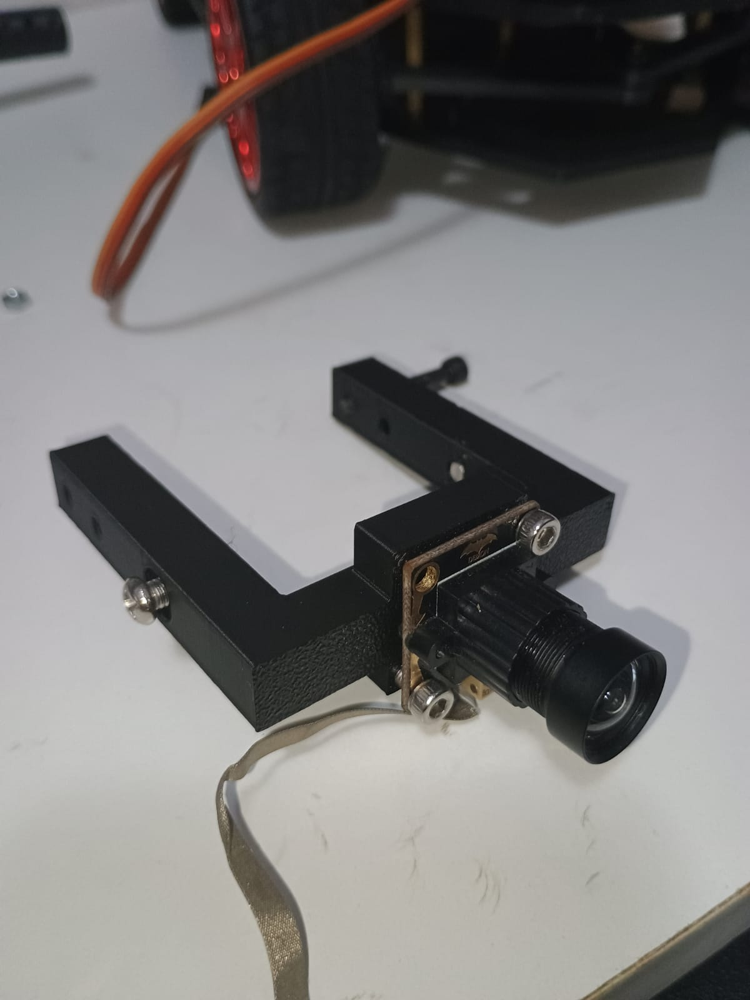

# 3D printed kit build guide

To assemble your 3D printed kit, you will need some additional components. This is a list of everything needed to assemble your car.



To print the car parts, you will need to use a G-code generator. The STL files for all 3D models are provided below. The STEP file is provided too if you want to improve the model. Insert STL files in your G-code generator of choice and print the required number of parts (see components list for required number of each part).



## Mechanical assembly

Note: You can see 4 screws on the top and bottom plate. That's because they are made of 2 printed parts screwed together. My print bed size is 18cm x 18cm x 18cm, too small for the plates.

&#x20;Position the motors on the bottom plate then fix them in place using the printed clamps with bolts and nuts.

<figure><figcaption>
Motors, clamps and the bottom plate
</figcaption></figure>

 

<figure><figcaption>
Motor fixed on the plate
</figcaption></figure>

Do the same for the other side.

<figure><figcaption>
Both motors fixed
</figcaption></figure>

Next, we will add the spacers. You can see in the photos below where every screw (the hexagonal ones) and spacer goes.

<figure><figcaption></figcaption></figure>

Now we can focus on the front of the car and its steering system.

<mark style="color:red;">**Attention!**</mark> <mark style="color:red;"></mark><mark style="color:red;">The servo motor should be in its starting position before starting the assembly. If you manually moved the servo arm prior to installing it, or just want to be safe, do not screw the horn in the servo until after centering your servo in your code.</mark>

Screw the arm and the servo horn together. Then attach them to the servo motor.

<figure><figcaption>
The servo, horn and arms
</figcaption></figure>

 

<figure><figcaption>
Servo horn and arms
</figcaption></figure>

<figure><figcaption>
Servo horn attached
</figcaption></figure>

Next let’s insert the bearings in the bearing holders. Take your time here, try to lightly hammer them in.

<figure><figcaption>
Bearing holder and cover
</figcaption></figure>

 

<figure><figcaption>
 
</figcaption></figure>

Finally add the PLA cover and the axle.

<figure><figcaption>
Adding the cover
</figcaption></figure>

 

<figure><figcaption>
Adding the axle
</figcaption></figure>

We can continue and attach the servo to the wheel plate.

<figure><figcaption>
Servo and the wheel plate
</figcaption></figure>

 

<figure><figcaption>
Servo attached
</figcaption></figure>

Then add the whole assembly to the bottom plate with 1 bolt and the 2 15mm spacers.

<figure><figcaption></figcaption></figure>

Now let’s add the bearing holders.

<figure><figcaption></figcaption></figure>

 

<figure><figcaption></figcaption></figure>

You need to position the spring and the bearing holder as shown in the picture, then insert the 36 mm screw through them. The spring is not on the shopping list, but you can obtain one from a pen and cut it to a suitable length. Do the same for the other side. Align the hole on the servo arm with the hole on the bearing holder then screw them together.

<figure><figcaption>
Screw the arm and the bearing holder 
</figcaption></figure>

Now add the wheels.

<figure><figcaption>
Wheel and M3.6 bolt
</figcaption></figure>

 

<figure><figcaption>
Wheels attached
</figcaption></figure>

Next we will add the top plate.

<figure><figcaption>
Adding the top plate
</figcaption></figure>

Let's add the camera holder.

<figure><figcaption>
Camera holder
</figcaption></figure>

 

<figure><figcaption>
Camera holder attached
</figcaption></figure>

After that we can position our display. You can chose any hole on the camera holder. Press the display in its box. Be careful not to pierce the box with the screw.&#x20;

<figure><figcaption>
Display in it's box
</figcaption></figure>

 

<figure><figcaption>
Display attached on the camera holder
</figcaption></figure>

Next we will add the part that slides on the camera holder. This way we can choose multiple positions on the y axis.&#x20;

<figure><figcaption>
Sliding component
</figcaption></figure>

 

<figure><figcaption>
First screw
</figcaption></figure>

 

<figure><figcaption>
Second screw
</figcaption></figure>

The next part will hold the camera. First we will screw it in the sliding component.

<figure><figcaption></figcaption></figure>

 

<figure><figcaption></figcaption></figure>

After that, the part moves freely. We can lock it in place using a screw and a nut.

<figure><figcaption></figcaption></figure>

 

<figure><figcaption>
Screw for locking it in place
</figcaption></figure>

Next we will position the cameras. The first one is pixy. Let's assemble the box.

<figure><figcaption></figcaption></figure>

 

<figure><figcaption></figcaption></figure>

<figure><figcaption></figcaption></figure>

Now we can screw the box and the rotating printed part.

<figure><figcaption></figcaption></figure>

For the linear camera we will simply screw it in the rotating component.

<figure><figcaption></figcaption></figure>

 

<figure><figcaption></figcaption></figure>

Next we will position the board. We will use nylon spacers, screws and nuts to avoid short circuits.

Screw the nylon spacers in the top board then lock them with nuts.

<figure><figcaption></figcaption></figure>

 

<figure><figcaption></figcaption></figure>

After that lock the board on the nylon spacers.

<figure><figcaption></figcaption></figure>

The hbridge is positioned on the back of the top plate with screws.

<figure><figcaption></figcaption></figure>

