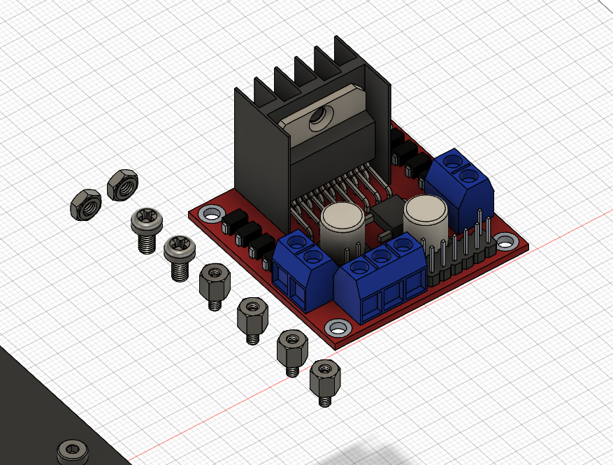

# 3D printed kit build guide

To assemble your 3D printed kit, you will need some additional components. This is a list of everything needed to assemble your car.



To print the car parts, you will need to use a G-code generator. The STL files for all 3D models are provided below. The STEP file is provided too if you want to improve the model. Insert the STL files in your G-code generator of choice and print the required number of parts (see components list for required number of each part).



## Mechanical assembly

### Upper and lower plates

The main strcture of the car is made of two large plates. For some 3D printers, these may be too large to fit on the bed. In that case, you can print the plates from two pieces and bind them together with screws.

To bind the two pieces, use four M3x12 bolts and four M3 nuts. Do the same for the upper and lower plate.

<figure><figcaption></figcaption></figure>

<figure><figcaption>
Lower plate assembled
</figcaption></figure>

<figure><figcaption>
Upper plate assembled
</figcaption></figure>

### Motors


Before mounting the motors, you must solder 16 AWG wires to their terminals.&#x20;


To mount the motors, you need eight M5x30 bolts and eight M5 nuts. Mount them like in the images below. Take care to not have anything pushing on the gearbox/reductor, as this will block the motors.

<figure><figcaption></figcaption></figure>

 

<figure><figcaption></figcaption></figure>

<figure><figcaption></figcaption></figure>

 

<figure><figcaption></figcaption></figure>

<figure><figcaption></figcaption></figure>

Next, mount the hexagonal adapters on the motor shafts. Fix them using the headless bolts that come packaged with it.

<figure><figcaption></figcaption></figure>

 

<figure><figcaption>
Adapters mounted
</figcaption></figure>

### Spacers

The M3x25mm female-female spacers are the ones in the front (3 spacers) and the M3x45mm female-female spacers are the ones in the back (4 spacers). Every spacer is secured with an M3x12mm bolt.

<figure><figcaption>
Four 45mm spacers
</figcaption></figure>

 

<figure><figcaption></figcaption></figure>

<figure><figcaption>
Three 25mm spacers
</figcaption></figure>

 

<figure><figcaption></figcaption></figure>

### Servo


<mark style="color:red;">**Attention!**</mark> <mark style="color:red;"></mark><mark style="color:red;">The servo motor should be in its starting position before starting the assembly. If you manually moved the servo arm prior to installing it, or just want to be safe, do not screw the horn in the servo until after centering your servo in your code.</mark> \ <mark style="color:red;">There is a code example provided for centering your servo, you just need to connect the servo, power it and run the example.</mark>


Screw the arm and the servo horn together with an M2-12mm bolt. Then attach them to the servo motor with the M2 bolt that comes with the motor.

<figure><figcaption></figcaption></figure>

 

<figure><figcaption></figcaption></figure>

<figure><figcaption>
Servo and arms mounted
</figcaption></figure>

### Wheel plate

Attach the servo to the wheel plate using four M3x12 bolts and the rubber spacers that come packaged with it.

<figure><figcaption></figcaption></figure>

 

<figure><figcaption></figcaption></figure>

<figure><figcaption></figcaption></figure>

 

<figure><figcaption></figcaption></figure>

Then add the whole assembly to the bottom plate with one M3x12mm bolt and the two M3x15mm male-female spacers.

<figure><figcaption></figcaption></figure>

 

<figure><figcaption></figcaption></figure>

### Bearing holders

Next insert the bearings in the bearing holders and the axles in the bearings. Take your time here, try to lightly hammer them in.

<figure><figcaption></figcaption></figure>

 

<figure><figcaption></figcaption></figure>

<figure><figcaption></figcaption></figure>

<figure><figcaption></figcaption></figure>

<figure><figcaption></figcaption></figure>

### Wheels

Now add the wheels. Back wheel hexagonal adapters come with their own bolts. For the front wheels two M3x12mm bolts are used.

<figure><figcaption></figcaption></figure>

<figure><figcaption></figcaption></figure>

<figure><figcaption></figcaption></figure>

### Top plate

Next, add the top plate and secure it with six M3x12mm bolts that screw into the spacers below.

<figure><figcaption></figcaption></figure>

<figure><figcaption></figcaption></figure>

Add the camera pole and secure it with two M5x20mm bolts and two M5 nuts.

<figure><figcaption></figcaption></figure>

 

<figure><figcaption></figcaption></figure>

### Display

You can chose any hole on the camera pole to mount the display on. Press the display in its box and mount it with a M3x20 bolt. Be careful not to pierce the box with the bolt.&#x20;

<figure><figcaption></figcaption></figure>

 

<figure><figcaption></figcaption></figure>

<figure><figcaption></figcaption></figure>

### Camera mount

Mount the vertical slider to the camera pole using one M3x25mm bolt at any height you want.

<figure><figcaption></figcaption></figure>

 

<figure><figcaption></figcaption></figure>

Attach the angled camera mount with two M4x12 bolts. Insert them in the **holes closest to the front of the vertical slider**. The two larger holes below them are for optional screws to stabilize the slider.

<figure><figcaption></figcaption></figure>

 

<figure><figcaption></figcaption></figure>

<figure><figcaption></figcaption></figure>

 

<figure><figcaption></figcaption></figure>

### Pixy camera

Assemble the Pixy box using two M3x20mm bolts in the bottom holes. Next, attach it using a M3x40mm bolt to the camera mount. Do this **before** inserting the last bolt, a M3x12mm bolt in the top hole of the box.

<figure><figcaption></figcaption></figure>

 

<figure><figcaption></figcaption></figure>

<figure><figcaption></figcaption></figure>

 

<figure><figcaption></figcaption></figure>

<figure><figcaption></figcaption></figure>

 

<figure><figcaption></figcaption></figure>

### Linear camera

For the linear camera, simply mount it in the rotating component using four M3x12mm bolts.

<figure><figcaption></figcaption></figure>

 

<figure><figcaption></figcaption></figure>

### Development board

For mounting the board, use nylon spacers, screws and nuts. Screw three nylon spacers in the top board and secure them with four nylon nuts.

<figure><figcaption>
Three nylon spacers
</figcaption></figure>

 

<figure><figcaption>
Board positioning
</figcaption></figure>

<figure><figcaption>
Mounted board
</figcaption></figure>

### Hbridge

The hbridge is positioned on the back of the top plate with four nylon spacers, two nylon screws and four nylon nuts.

<figure><figcaption></figcaption></figure>

 

<figure><figcaption></figcaption></figure>

<figure><figcaption></figcaption></figure>

### ESC, Receiver and LiPo battery

Since batteries and ESCs come in many shapes and sizes, and the receiver does not have any mounting options, a good way of securing them to the car chassis is double sided tape.
