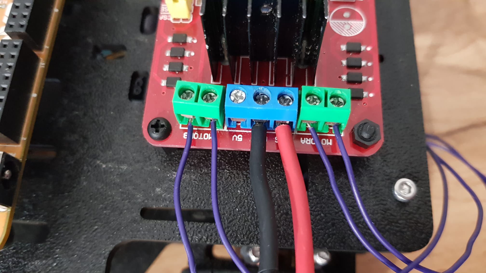
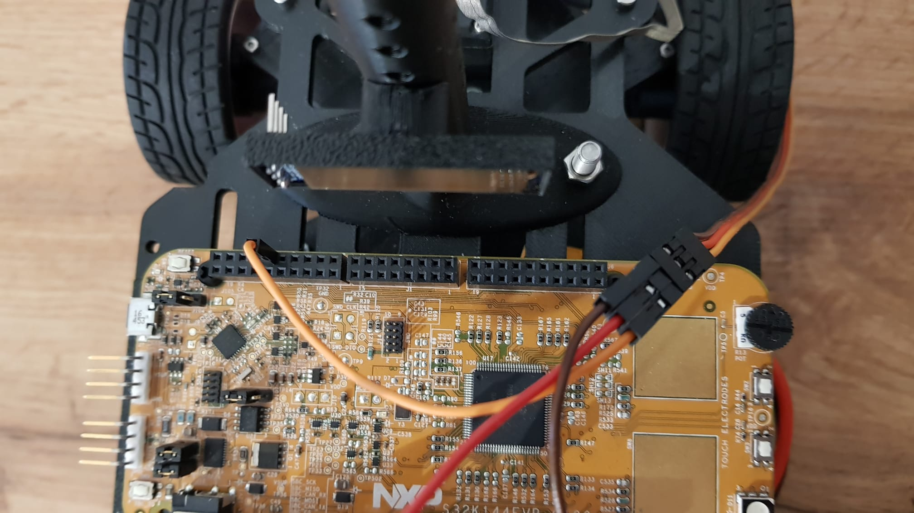

# Electrical connections

Note: For some of these steps soldering tools may be required.

### Board pins

<figure><figcaption></figcaption></figure>

Refer to [S32K144EVB](https://www.nxp.com/design/design-center/development-boards-and-designs/automotive-development-platforms/s32k-mcu-platforms/s32k144-q100-evaluation-board-for-automotive-general-purpose:S32K144EVB) for more information about the board. Here you will find a picture with all the board pins and pin names. You can also see all pin names on the back of the board. **The board's jumpers are also detailed here, used for selecting power input source (battery or USB).**

### Powering the board

The board can be powered in two ways: through the micro usb connector on the top left, or through the onboard voltage regulator. The voltage regulator is connected to both the LIN pins and the barrel jack connector.

To select between micro usb and onboard regulator, you must move the highlighted jumper accordingly. To power it via usb, put it in the left position. To power it via the onboard regulator, put it in the rightmost position.

<figure><figcaption>
Power selection jumper highlighted. Micro usb power is selected
</figcaption></figure>

For powering the board you will need the following XT60 connector. You can either buy one or make one yourself from two XT60 connectors and two wires/jumpers.&#x20;

<figure><figcaption>
XT60 passthrough with dupont adapter 
</figcaption></figure>

You can use double sided tape to secure the battery on the bottom board. **Make sure you can still take it out for charging.**

<figure><figcaption></figcaption></figure>

The red (vcc) and black(gnd) dupont wires will be connected to the LIN header pins, VBAT and GND as you can see in the picture below. **To power the board, make sure the jumper for selecting input power source is in the right position.**

<figure><figcaption></figcaption></figure>

The LiPo battery goes in the female port of the connector, and the ESC/Hbridge goes in the male port of the connector. Most ESC already have a connector soldered, but for the Hbridge you will need to provide one yourself. Again, you will need an adapter which you can buy or make yourself.

<figure><figcaption>
Hbridge power adapter
</figcaption></figure>

### H Bridge


H Bridge circuit datasheet


Firstly, we will connect the battery adapter and motors.

<figure><figcaption>
Hbridge ports 
</figcaption></figure>

Loosen the screws on the Hbridge ports. Insert the cables from the power adapter in the GND and VMS ports, and screw them in. Insert the cables from the first motor in MOTORA, and the second motor in MOTORB.

Note: the 5V port will be used for powering the servo.

<figure><figcaption>
Motor cables
</figcaption></figure>

 

<figure><figcaption>
Motor cables connected
</figcaption></figure>

This is how it should look completed:

<figure><figcaption>
Final result
</figcaption></figure>

Next are the connections for controlling the H bridge. Connect them like in the picture. You can also use the picture at the beginning of this page for reference.

<figure><figcaption></figcaption></figure>

 

<figure><figcaption></figcaption></figure>

### Servo

Servos have a 3-pin connector for power, pwm and ground. This servo has a brown ground, red power and orange pwm wires. Connect the pwm and ground wires to the board, and the power wire to the H bridge or ESC, depenting on what you are using.

<figure><figcaption>
Pwm and ground wires connected to the board
</figcaption></figure>

 

<figure><figcaption>
Power wire connected to the H bridge
</figcaption></figure>

### ESC

Electronic speed controllers have the same 3-pin connector for power, PWM and ground.

Note: These controllers come in many shapes and sizes, and many do not have any mounting hardware. You can use double-sided tape to mount it to your upper plate in the place of the H bridge.

<figure><figcaption>
ESC with connectors for two motors
</figcaption></figure>

Connect the red power pin of the ESC to the power pin of the servo. The ground wire of the ESC must be connected to both the servo and the development board. You can either solder the ends of three wires together or use a 3-pin male header to connect three jumpers and solder a wire across the exposed ends.

<figure><figcaption>
Connecting the three grounds together in the male header with a wire soldered across it
</figcaption></figure>

 

<figure><figcaption>
Two grounds connect the ESC and Servo, the last one will go in the microcontroller.
</figcaption></figure>

<figure><figcaption>
ESC connections
</figcaption></figure>

 

<figure><figcaption>
Servo connections
</figcaption></figure>

<figure><figcaption>
All connections
</figcaption></figure>

### Pixy

Official Pixy2 documentation:  [https://docs.pixycam.com/wiki/doku.php?id=wiki:v2:start](https://docs.pixycam.com/wiki/doku.php?id=wiki:v2:start)

The Pixy2 with the I2C interface needs four pins: power, ground, SCL and SDA.  Connect them like in the pictures below.&#x20;

Note: You might need to use longer jumpers, or daisy chain multiple jumpers to reach the desired height with the camera.

<figure><figcaption>
Daisy chained jumpers
</figcaption></figure>

 

<figure><figcaption></figcaption></figure>

Here you can see the pins used on the camera. Make sure you use the **5V pin** and not the **Vin pin** for powering the camera.

<figure><figcaption>
Pixy pins documentation
</figcaption></figure>

<figure><figcaption></figcaption></figure>

### Display


Display driver chip datasheet


The display has power, ground, SCL and SDA pins. Connect them like in the pictures below. You can see each pin designation written on the display PCB.

<figure><figcaption></figcaption></figure>

 

<figure><figcaption></figcaption></figure>

<figure><figcaption></figcaption></figure>

### **Pixy and display**

Since both components use I2C, they must connect to the same SCL and SDA pins of the microcontroller. You can either solder the ends of three wires together, or use a 3-pin header with a soldered wire across it, like you can see below.&#x20;

<figure><figcaption>
The 3-pin header with a soldered wire across it
</figcaption></figure>

 

<figure><figcaption>
Jumpers connected to the header
</figcaption></figure>

One end goes to the camera, one to the display and one to the microcontroller. The pictures below do not show the power and ground wires so you can see the SCL and SDA wires easier. The power and ground connections are the same ones as seen before.

<figure><figcaption></figcaption></figure>

 

<figure><figcaption></figcaption></figure>

### Linear camera


Linear camera datasheet


Linear camera modules come in many shapes and sizes. For our particular model, the camera is connected through a ribbon to the pin header. You can see the name of each pin in the picture below.

<figure><figcaption>
All connections
</figcaption></figure>

 

<figure><figcaption>
Ribbon cable breakout board connections
</figcaption></figure>

 

<figure><figcaption>
Board connections
</figcaption></figure>

### Receiver


Receiver manual



Transmitter/RC Remote manual


The receiver needs 3 pins: power, ground and PPM. The PPM signal is available on the leftmost column of the receiver.

<figure><figcaption></figcaption></figure>

 

<figure><figcaption></figcaption></figure>

The PPM signal must also be enabled in the remote's settings. On the touchscreen, hold the lock button for a few seconds to **unlock the settings button, and press it**.&#x20;

<figure><figcaption>
Initial remote screen
</figcaption></figure>

 

<figure><figcaption>
Screen after holding the 'Lock' button
</figcaption></figure>

In the new menu, press on SYS to enter system settings.

<figure><figcaption>
New 'Function' menu
</figcaption></figure>

 

<figure><figcaption>
'System' or SYS menu
</figcaption></figure>

Scroll down to find the 'Output' tab and select it. In the new tab, under Output select PPM insead of PWM. This will change the leftmost data pin of the receiver to output eight channels on one pin with a PPM signal, instead of just one PWM signal assigned to the first channel. The Serial parameter on the right does not matter.

<figure><figcaption>
Scrolled down in the 'System' tab to find 'Output'
</figcaption></figure>

 

<figure><figcaption>
Output mode configured to use PPM
</figcaption></figure>

