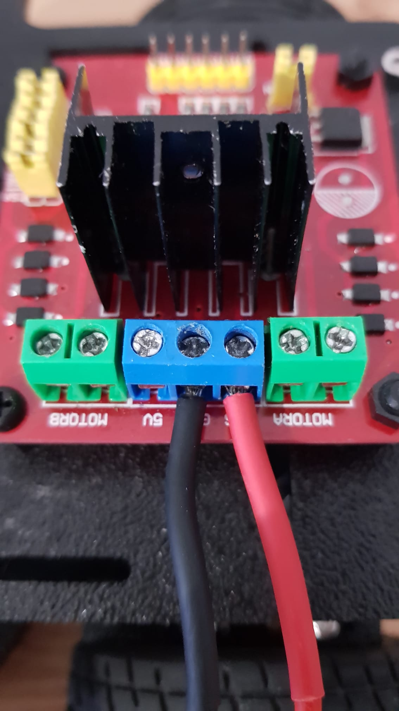
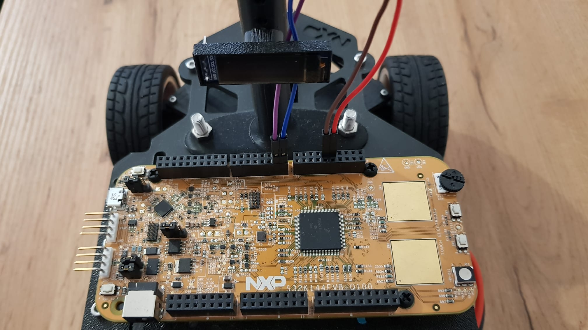
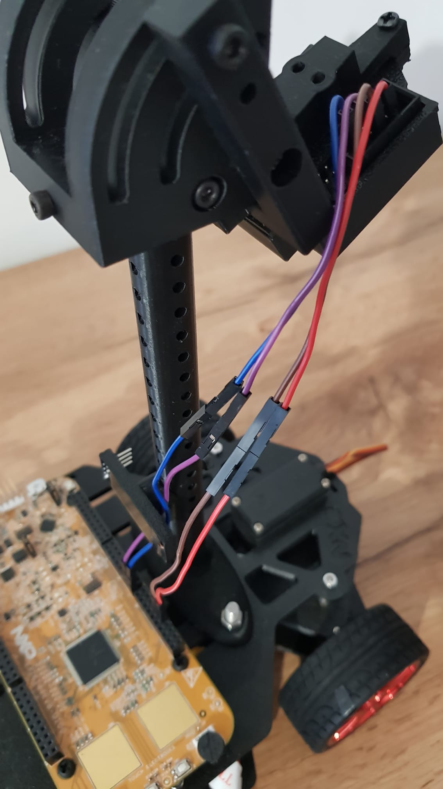
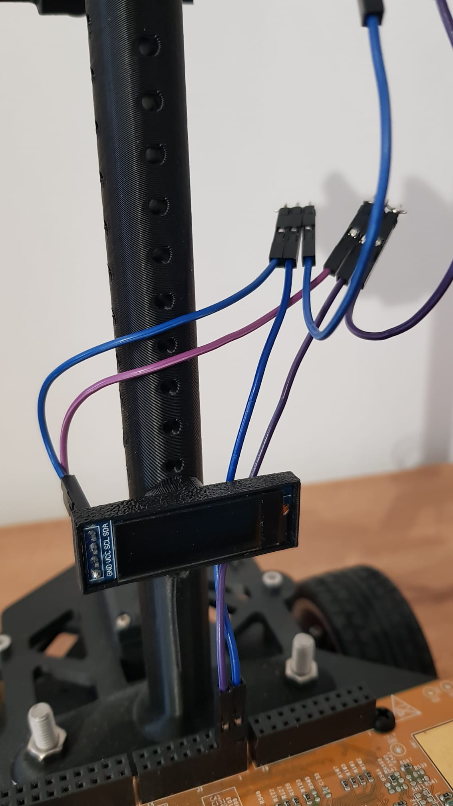
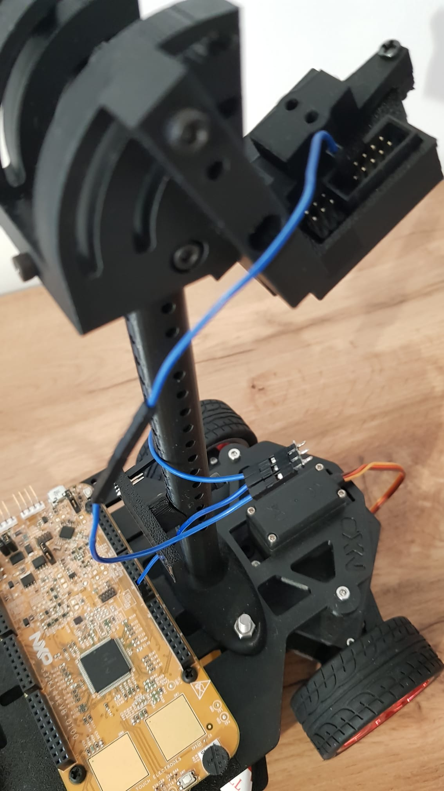
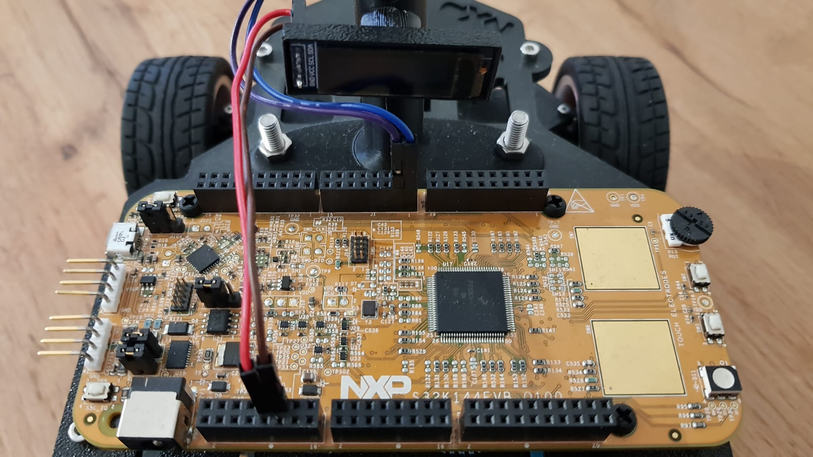

# Electrical connections

Note: For some of these steps soldering tools may be required.

<figure><figcaption></figcaption></figure>

Refer to [Getting Started with the S32K144EVB | NXP Semiconductors](https://www.nxp.com/document/guide/getting-started-with-the-s32k144evb:NGS-S32K144EVB) for more information about the board. Here you will find a picture with all the board pins and pin names. You can also see all pin names on the back of the board. **The board's jumpers are also detailed here, used for selecting power input source (battery or USB).**

## Powering the board

For powering the board you will need the following xt60 connector. You can either buy one or make one yourself from two XT60 connectors. The red (vcc) and black(gnd) dupont wires will be connected to the LIN header pins, VBAT and GND as you can see in the picture below.

<figure><figcaption>
XT60 passthrough with dupont adapter 
</figcaption></figure>

 

<figure><figcaption>
powering the S32K144
</figcaption></figure>

The LiPo battery goes in the female port of the connector, and the ESC/Hbridge goes in the male port of the connector. Most ESC already have a connector soldered, but for the Hbridge you will need to provide one yourself. Again, you will need an adapter which you can buy or make yourself.

<figure><figcaption>
Hbridge power adapter
</figcaption></figure>

### I2c connections

The OLED display and the Pixy2 camera share the same I2c channel. You must connect all SCL pins together, then do the same for SDA. The picture below shows one way of doing it. This must be done twice, once for the SCL pins and once for the SDA pins.

<figure><figcaption>
I2c connection. Purple wire goes to K144, green to display and blue to camera.
</figcaption></figure>

## Board connections

<figure><figcaption>
Placeholder for photos of connections
</figcaption></figure>

### Servo

<figure><figcaption></figcaption></figure>

 

<figure><figcaption></figcaption></figure>

### ESC

<figure><figcaption></figcaption></figure>

 

<figure><figcaption></figcaption></figure>

<figure><figcaption></figcaption></figure>

 

<figure><figcaption></figcaption></figure>

<figure><figcaption></figcaption></figure>

 

<figure><figcaption></figcaption></figure>

 

<figure><figcaption></figcaption></figure>

### H Bridge


H Bridge circuit datasheet


<figure><figcaption></figcaption></figure>

 

<figure><figcaption></figcaption></figure>

<figure><figcaption></figcaption></figure>

 

<figure><figcaption></figcaption></figure>

<figure><figcaption></figcaption></figure>

<figure><figcaption></figcaption></figure>

 

<figure><figcaption></figcaption></figure>

### Pixy

[https://docs.pixycam.com/wiki/doku.php?id=wiki:v2:start](https://docs.pixycam.com/wiki/doku.php?id=wiki:v2:start)

<figure><figcaption></figcaption></figure>

 

<figure><figcaption></figcaption></figure>

<figure><figcaption>
Pixy connections
</figcaption></figure>

**Connecting both pixy camera and the display**

<figure><figcaption></figcaption></figure>

 

<figure><figcaption></figcaption></figure>

 

<figure><figcaption></figcaption></figure>

<figure><figcaption></figcaption></figure>

 

<figure><figcaption></figcaption></figure>

Linear camera


Linear camera datasheet


<figure><figcaption></figcaption></figure>

 

<figure><figcaption></figcaption></figure>

 

<figure><figcaption></figcaption></figure>

### Display


Display driver chip datasheet


<figure><figcaption></figcaption></figure>

 

<figure><figcaption></figcaption></figure>

<figure><figcaption>
Display connections
</figcaption></figure>

### Receiver


Receiver manual



Transmitter/RC Remote manual


