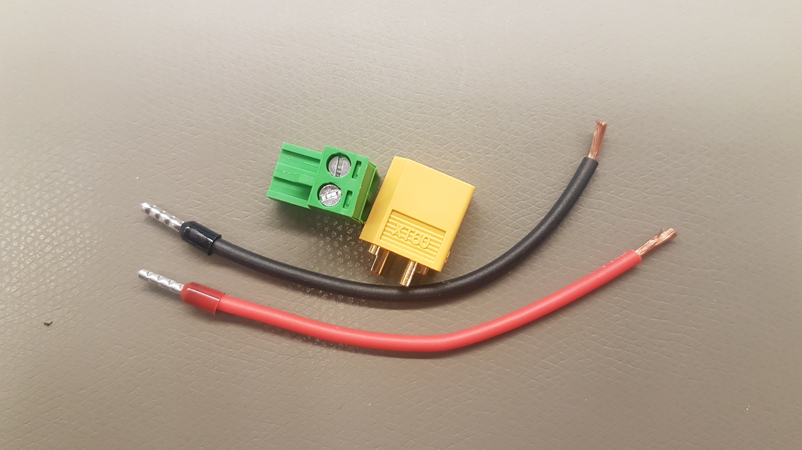
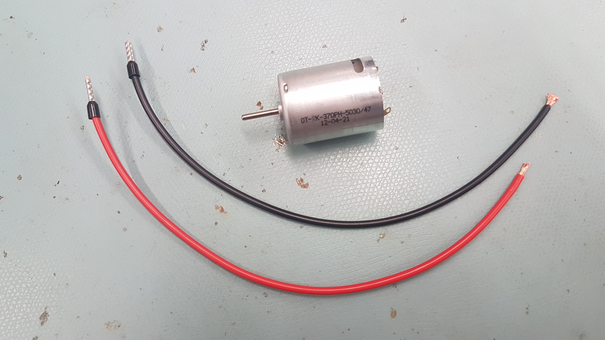
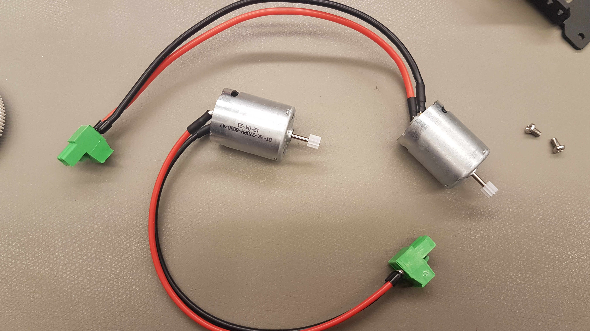
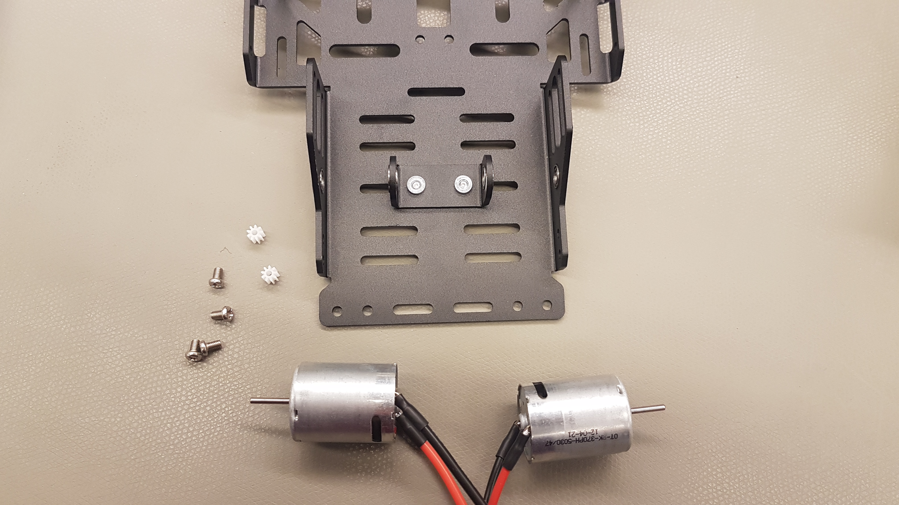
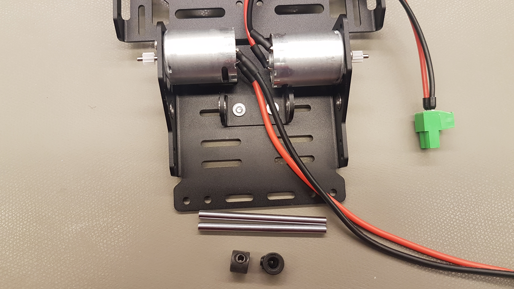

# Brushed: Motors and Power connection

## Power connection for the Micro E board

For the connection of the Micro E board with a battery you need an adapter and an cable extension. The board should be delivered with a green connector for the power connection. In the standard brushed motors kit is a yellow XT60 connector and a black and a red cable delivered. Each cable needs to be prepared with a wire end ferrule at one end. The other end has be stripped and the XT60 connector has to be soldered to the ends. **Pay attention to the polaity of the connector**: The black cable must be soldered to the "-" side of the connector and the red cable has to be soldered to the "+" side of the connector.

The wire end ferrules can be fixed at the green connector. The polarity should be as shown in the picture below.

### Power connection for other boards

If you are using the FMUK66 follow the instructions on this side:



If you are using other boards than the Micro E or the FMUK66, pay attention to the specifications of your boards and do the power connections accordingly. If you are using a battery with a XT60 connection, use the delivered XT60 male connector between your board and the battery.

## Motor assembly without ESCs \(for Micro E board\)


The following description is for using a Micro E board which has two double H-bridges for the motor control on board and do not need ESCs. 

In case you use another board \(like FMU, or different boards\) and you need ESCs for the Motors follow the instructions below the next heading \(and skip this section\).


For connecting the motors to the Micro E board you need additionally two wires per motor and one wire end ferrule per wire. This items are not included in the kit, you have to get them on your own.

Strip the ends of the cables. A wire end ferrule must be attached to one end of each cable. The other ends must be soldered to the motors. Each motor has a **red dot next to one of the connectors**. Solder the red cable here. The black cable has to be soldered to the other connector. Isolate both contacts with some heat shrinkable tubing.

Now connect the wire end ferrules to the green connectors. Both motors must be connected to the green connectors in the same way. \(The motor cables are installed exactly the other way round as for the battery cable.\)

Finally the small white gear wheels have to be put on the motor axis. You may need some force to push the gear onto the axis. Push the gear onto the axis only so far that it is flush with the end of the axis. Otherwise is does not fit with the big white gear wheel. 

## Motor assembly with ESCs

If you are using the Micro E board, you can skip this chapter.

The ESC must be soldered to the motor and the XT60 Connector in the way the picture above shows. The inner cables of the ESC are soldered to the motor. The red cable is soldered to the motor connector with the red dot. The black cable is soldered to the other connector. The outer cables of the ESC are soldered to the XT60 connector. **Pay attention to the inscription on the connector for "+" and "-"**. 

In the case that the kit has **two motors and two ESCs**, both ESC power connections have to be soldered to the **same XT60 connector** \(unlike the picture above\). The cable with the three wires \(black, red, white\) is for the PWM connection to the board. Do not change this cable. Later you can connect it to your board.

Finally the **small white gear wheels** have to be put on the motor axis. You may need some force to push the gear onto the axis. Push the gear onto the axis only so far that it is flush with the end of the axis. Otherwise is does not fit with the big white gear wheel. 

## Mounting the motors to the chassis

Regardless of whether ESCs have been used or not, the motors are installed as follows:

