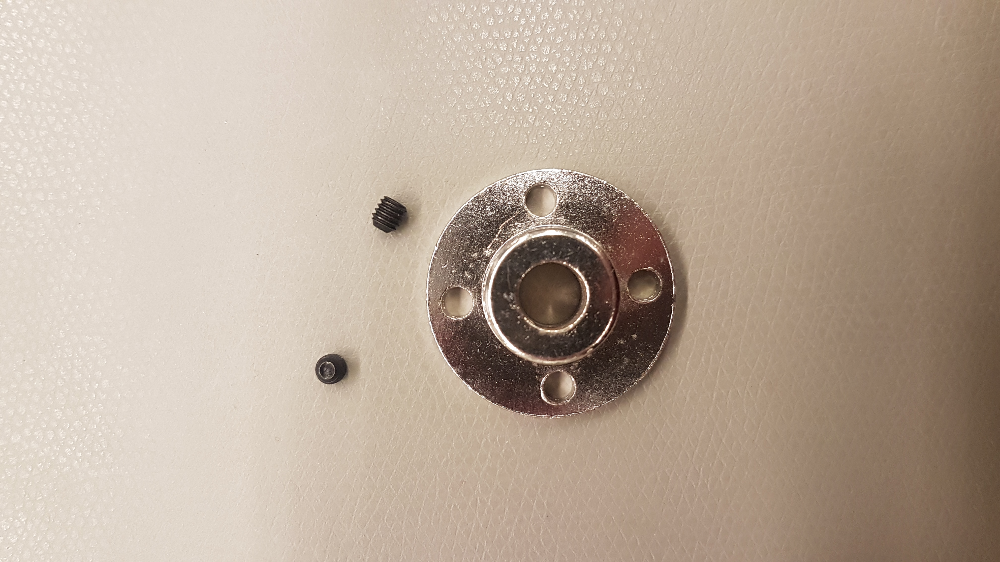
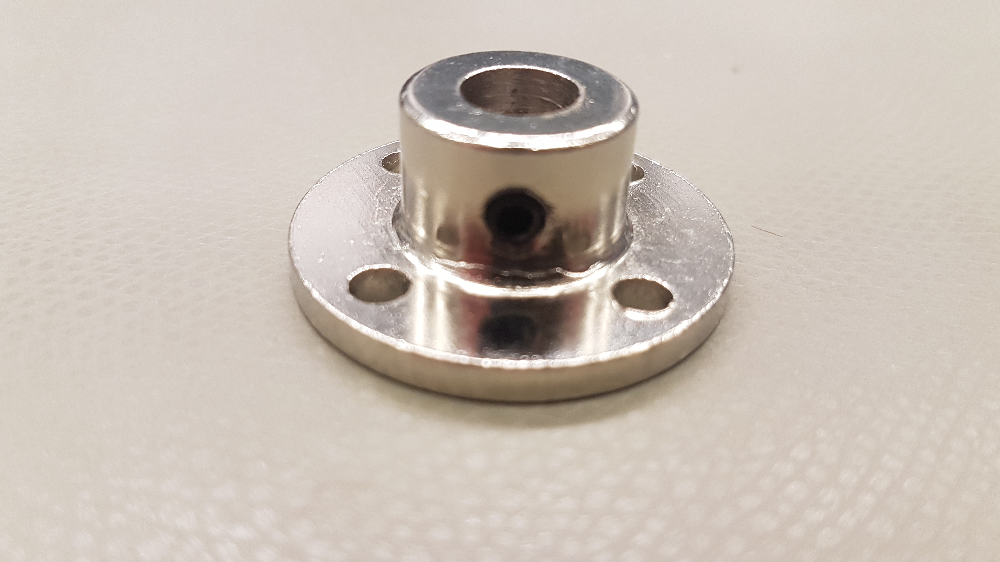
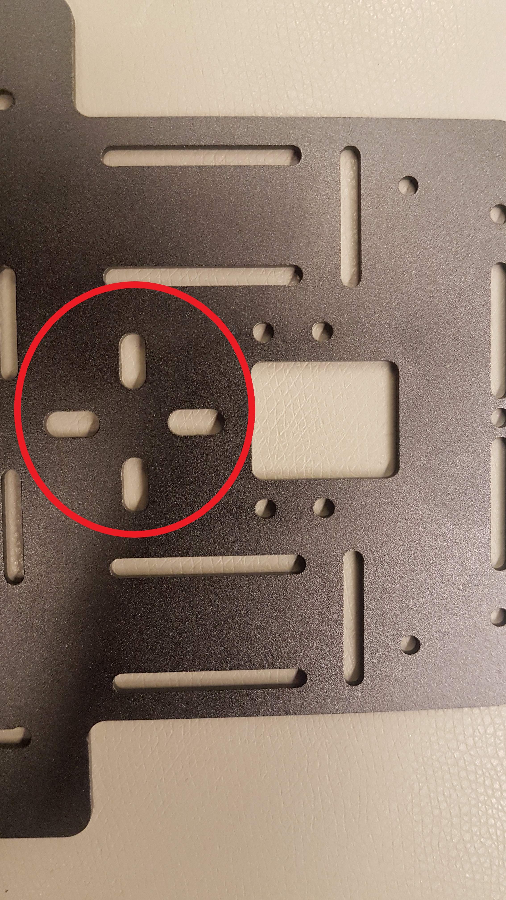
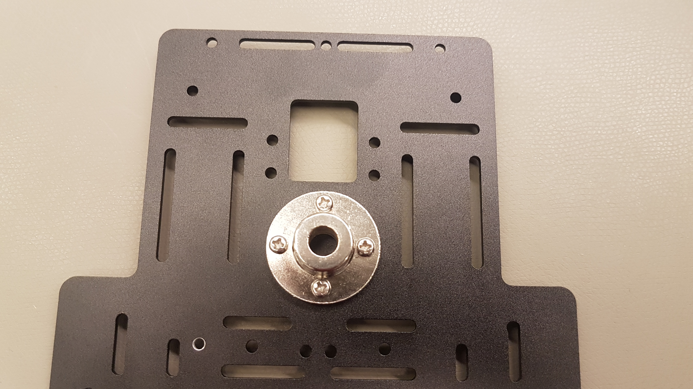
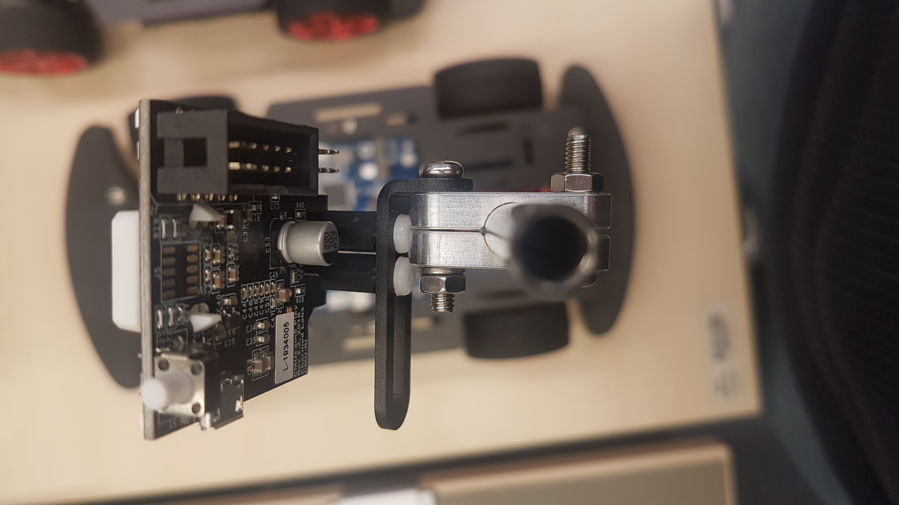
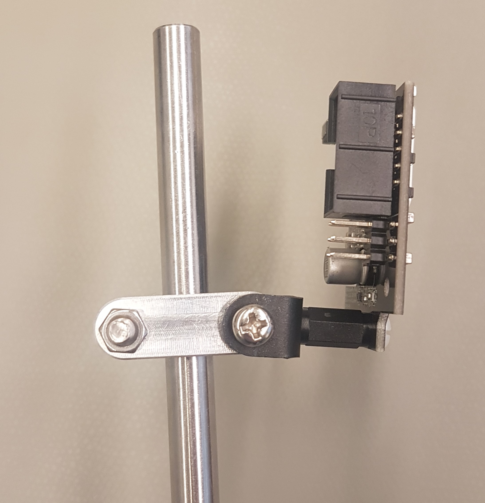

# Camera mount

First tighten the hub screws to the silver flange but do not tighten the screws completely.


NOTE: If you used the extra set screws from the camera mount for your brass wheel mounts, we suggest using super glue or some other type of expoxy to secure the camera mount rod to the base.


In the back of the top plate are four oval holes which are arranged like a cross. This is the place for the camera flange.

Fix the flange with four M4x8 screws and four M4 nuts.

The camera mounting clamps are fix to the rod with two M4x20 screws and two M4 nuts. In the front one camera L-type mounting plate is fixed with the screw additionally. The longer L-side leads across the camera pole. Before you fix the L-type mounting plate to the mounting clamps, screw the camera to the L-type plate. Therefore you need  two M3x12 double pass plastic columns and four M3x5 plastic screws. \(These are not included on the kit yet.\) Mount them as shown in the pictures below.

It might be good to fix the camera as far up as possible. This ensures a good view for the camera.

Last but not least put the pole into the flange and connect the camera with the for your board right cable. The kits come with a cable for the Micro E board or the FMU. If you are using a different board, you may produce a separate cable.

