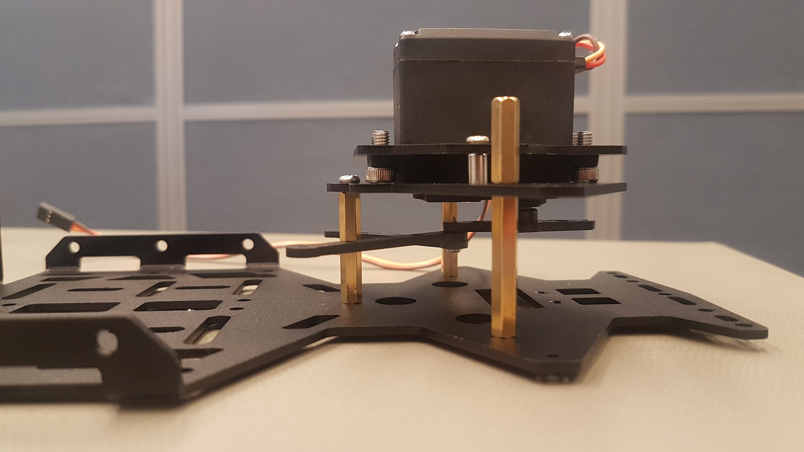

# Lower plate, servo motor and front wheels

## Assembly of the lower plate

First you need the lower plate, three of the M3x27 double pass copper columns and three M3x6 screws.

Fix the M3x27 double pass copper columns with the three screws at the points shown in the picture below. The double pass copper columns must be fixed on the upper side of the plate.

## Mounting the Servo

In the first step of mounting Servo, you need the Servo, the Servo fixed board and four M4x8 screws \(you find them in the same bag the servo was in\).

Fix the servo with the screws to the Servo fixed board as shown in the picture below:

Now you need additional the front wheel cover and two M3x6 screws.

Mount the front wheel cover in top of the Servo. The screws can be fixed in the silver holes of the front wheel cover.


The servo is mounted upside down in the next three images. The heads of the M4 screws need to be facing towards the second plate, not away. The last image shows how to mount the servo correctly to the second plate.


In the next step mount the Servo-arm with a screw from the servo kit to the Servo connector. The Servo-arm should look like the one in the picture below. 

### 2021 and newer version

The 2021 DFRobot Cup Car has a new steering linkage setup. If you have a 2020 or older version, skip to the next section.

There are two parts that you need to mount the control arms to the servo. The two parts are pictured below:

The part on the left is what the control arms will attach to, and the part on the right attaches to the servo itself. These two parts will be connected together later. First, you'll want to attach the part on the right to the servo, and fasten it using the two screws that came in the bag with it. These screws go into the sides of the part to give it clamping force on the servo.

Once you have attached that part, you'll want to fasten the next part on top using two M3x6mm screws. 

The two M3x6mm screws will fasten into the servo itself as well as one of the holes at the bottom of the two parts. Next, fasten the two control arms to the side holes on the mounting plate using M3x16mm screws and M3 locknuts like so:

### 2020 and older version


**Do not rotate the Servo connector before the arm is fixed to it!** When you put the arm to the connector be sure that the arm is absolutely parallel to the longer side of the Servo. This ensures that the wheels have the full steering range.


Fix the two steering rods to the Servo-arm with a M2x8 self-tapping screw. Use the outermost hole of the Servo-arm on the \(in this picture\) right side.

Now we want to mount the servo motor to the lower plate. Now need the lower plate, the Servo assembly a M3x6 screw and two M3x16 single head copper column. Before you fix the Servo assembly make sure, that each steering rod is between the middle double pass copper column and one of the outer one \(as show two and three pictures below.

Fix the Servo assembly to the plate as follows: Use the M3x6 screw for the double pass copper column in the middle and use the two single head copper columns to fix the Servo on the left and right side. 

## Mounting the front wheels

The mounting of the two front wheels is similar. As preparation you need the following pieces for the steering cup:

Put the smaller silver ring in the outer smaller space and the bigger silver ring in the inner space of the steering cup as shown in the picture above. 

Now, put the screw through the hole from the inside to the outside. Be sure that the screw is fully pushed through because you have to fix the screw with the small stick on the other side. \(Compare with the picture below\).

To fix the stick, push the black hexagonal part to the screw so that the pin is fixed.

The steering cups can now be fixed to the wheels. You need two wheels, the assembled steering cups and  two M4 lock nuts. Put the steering cups into the wheels and fix them with the lock nuts from outer side. Compare your setup with the following three pictures.

Repeat this for the second wheel.

The wheels should be mounted to the lower plate now. You need the lower plate, the front wheels, two springs and two M2x35 screws.

First insert a screw on one side through the outermost hole of the servo mount, then push the spring through from the other side of the screw. Now you can put a steering holder on the screw. Attention: The rod of the steering cup must be pointing backwards to the rover. It should be mounted to the Steering rod in the next step. Now put the screw through the hole in the lower plate. Finally, the screw must be fixed with a M2 locknut.   
Repeat for the second wheel.

The steering cups have to be connected to the steering rods now. Therefore you need a M2 screw and an anti-fall nut. They are not included in the kit \(the delivered instructions says to use a M2 self-taping screw which do not fit here, because the hole is too big for the M2 self-taping screw.\)

If you have no anti-fall nut you can fix the nut with some glue. But before you buy glue, buy some anti-fall nuts. This ensures a flexibility of the setup and the nuts are safer than the glue.

