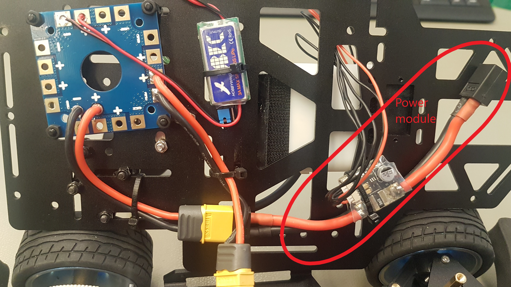

# Brushless: Motors, ESCs and Power Module

## Brushless ESC

The motors must be soldered to the ESCs. The sequences must be observed carefully. Both motors must be connected differently, as they are mounted opposite each other on the chassis and should nevertheless move in the same direction.

#### How to connect (from left to right, when you are looking to ESC, so that you can read the description)

**Left moto**r: yellow, red, black

**Right moto**r: red, yellow, black


This will be mentioned elsewhere in the guide, but the UBEC seen in the last image on this page (the small blue component in the middle of the image) is required to power the steering servo. Keep this in mind before you solder the ESCs to the XT60 connector (if you don't have a power distribution board).


The power cables have to be soldered to the XT60 connector. Be aware that you have to solder both ESC to **ONE **XT60 connector! Alternatively, you can solder the ESCs to a Power Distribution board and solder the XT60 with some cable to the Power Distribution Board either. (Detailed description at the [Known issues](https://nxp.gitbook.io/nxp-cup/developer-guide/assembly/dfrobot-chassis/known-issues), similar to the FMU power distribution board)


Please try to solder as short as you could. The longer the soldering takes, the more solder is drawn into the cable and the cable becomes inflexible and can break more easily.


Fix the ESC to the Chassis with a cable tie so that the ESC cannot get in conflict with the external rotors.

## Mounting the motors

You can mount the motors the same way as the brushed motors. Keep in mind that the brass gears are hard to press onto the motor shafts. You may need to use something to hammer them onto the shaft like the nut-driver seen below.

The motors have two different diameter mount points. You can use either. The longer diameter mount points will require you to mount the motor at an angle, but this can be beneficial because it will give you some lee-way to get the gears meshed just right.


Be careful when choosing the screws to mount the motors with. If the screws are too long, they will get into the windings of the motor and ground the motors to the frame. This can cause significant damage to the motor. The short M3 screws should do the trick.

Also, the M3 screw heads are a little small for the slots to mount the motors. You might want to use some washers so that you get a better mount.


## Power Connection w/ distribution board

In the FMU kit is a power module. This can be fixed to the lower side of the upper plate with a cable tie. The male connector will be plugged to the battery later. So is might be good to fix the power connection in a position that you can easily reach the male connector later. The female connector must be plugged to the ESC connector. In the case that you use a Power Distribution board (PDB), the power module should be connected to the Power connector of the PDB. 

