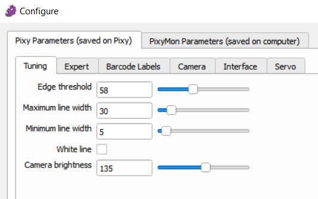

# Commissioning the Pixy 2


Further information of the Pixy 2 can be found [here](https://docs.pixycam.com/wiki/doku.php?id=wiki:v2:start).

The Pixy 2 can be commissioned and parameterized by the **PixyMon** software. A quick manual can be found [here](https://docs.pixycam.com/wiki/doku.php?id=wiki:v2:pixy_regular_quick_start). 


Within the PixyMon Software the Pixy 2 parameter for line tracking can be optimized. Following pictures show the nearly optimal settings for line tracking on the NXPCup track.

## 
I2C Communication

For an I2C communication follow up this [guide](https://docs.pixycam.com/wiki/doku.php?id=wiki:v2:porting_guide). The default address is 0x54. The demo code using the FMU on this [page](https://nxp.gitbook.io/nxp-cup/developer-guide/development-tools/rddrone-fmuk66-development/commissioning-the-rddrone-fmuk66/the-example-application) runs with the default I2C address.‌

## SPI Communication

For an I2C communication follow up this [guide](https://docs.pixycam.com/wiki/doku.php?id=wiki:v2:porting_guide). The demo code using the ARC board runs with SPI.

