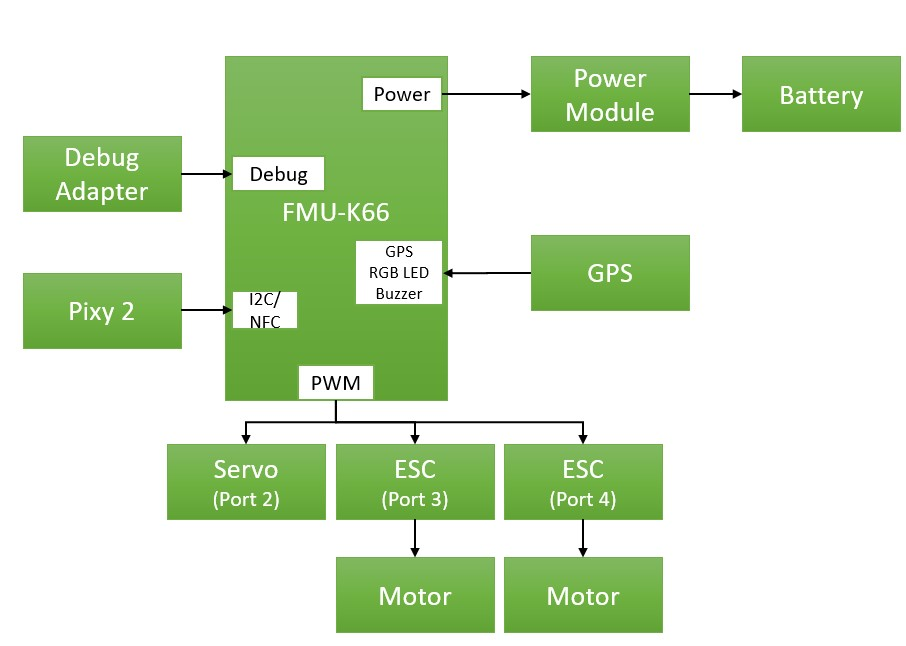
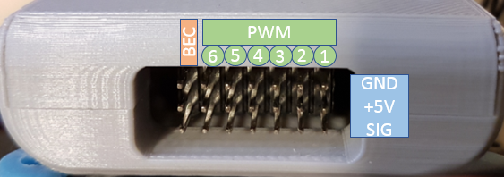

# Connecting all FMU wires

## Connector pinout 

We are almost ready. We only need to connect the wires to the right connectors on the FMU. A diagram showing all port locations is available below. [More indepth information](https://nxp.gitbook.io/nxp-cup/hardware-reference/connectors-and-pinout) is also available in the technical reference section. Port locations on the RDDRONE-FMUK66 Rev. C.

For the Rover setup the connections shown in the picture below are needed.


One part in this image is missing. In order to control the steering servo you will need an UBEC/BEC to power the +5V rail on the FMU. The FMU does not provide this power by default.

If you do not have an UBEC, the servo will not move. The second image below shows where the UBEC needs to be connected.


## Servorail

| Kind of motor | PWM output |
| :--- | :--- |
| Servo | 2 |
| Motor left | 3 |
| Motor right | 4 |
| UBEC | BEC \(Pin 7\) |

