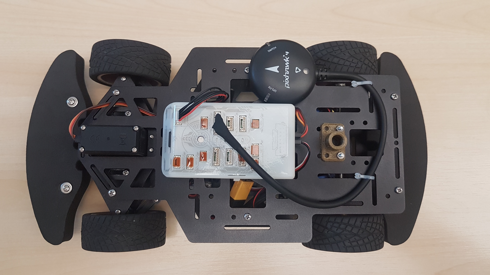
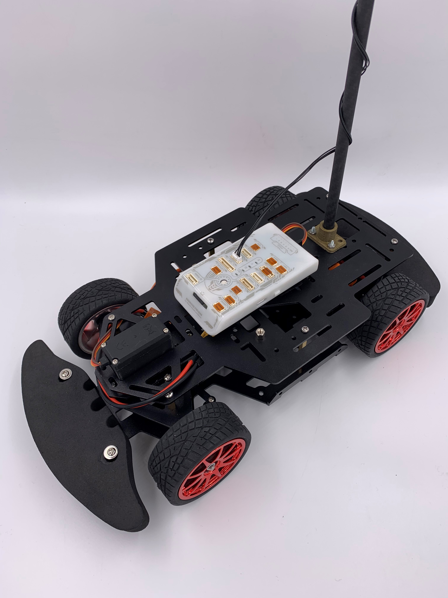

# FMU assembly

The FMU needs a power module which is included in the FMU kit. You can mount the power module with a cable ties below the top plate. Connect the female socket to the ESC power cables. Finishing the mounting inside the chassis, you can fix the top plate with six screws to the hexagonal spacers. Be aware of the power connector cable, the servo cable and the ESC cables. Pull the cable through suitable openings to connect it to the FMU. The FMU itself can be mount with Velcro self-adhesive in the middle of the top plate. The GPS can be mounted on the top plate with double-sided tape and cable ties. The kit includes a pole mounting for the GPS. You can use the pole and install the GPS on the back part of the plate if you like.


The GPS is just used because of the button at the GPS module. You can run the rover for the cup without a GPS connection.

But if you like to use the rover outside, the GPS may also be useful.


