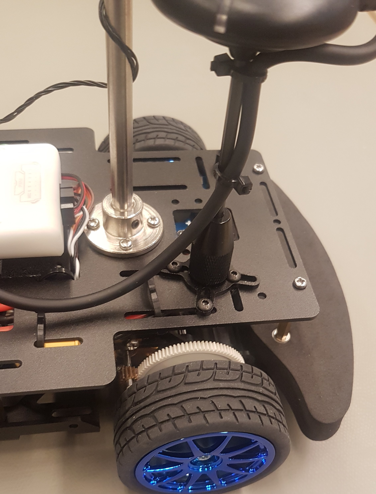

# GPS and Telemetry


Mount the GPS and the telemetry as far away from each other as possible to avoid parasitic effects.


## Installing the GPS

The GPS and its mount consist of several parts. The GPS should come with a **short **and a **long **rod. We **recommend to use the shorter one**, because it won't vibrate as much as the longer rod. However, many successful tests were done with the long one as well, so ultimately it comes down to personal preference. The longer one is useful when you get too much interference from the other electronics on the rover.


You will need a 1.5 mm hex/Allen key for the very small screws that keep the rod in place. 

\
Also, some GPS mounts have a Phillips/Pozidriv screw instead of 2.5 mm hex screw. You might need an additional screwdriver for this as well.


A small part that will hold the rod should be screwed onto the cross-shaped base, using a hex screw. 

The rod can be inserted into this piece and will be kept in place with a tiny hex screw.

You should put the big "cone" over the rod, you can screw this onto the base.

On top, you should have a big flat piece, which is also kept in place with a tiny hex screw.

With the included double sided tape, you can install the GPS itself on top. Make sure the arrow on the GPS aligns with one of the "arms" of the cross-shaped base. It doesn't have to be perfect, you will be able to slightly rotate the GPS after loosening the small screw in the top part of the mount.

We also suggest to remove the piece of heatshrink at the end of the GPS cable, just before the connector. Be careful to not cut the wires! The reason for this is that this heatshrink is quite stiff and in some cases this would cause mechanical vibrations in the GPS mount to be "transmitted" by the cable to the FMU.

Once it's assembled, the GPS mount can be installed onto the top plate. It's easier to do this now, because you can easily access the bottom side of this plate.

Now you can mount the base of the rod to the top plate of the rover. The best place is the left back corner (compare with the pictures below). Use the four black screws which were included in the GPS kit and the lock nuts. It may be helpful to remove the top plate before.

## Telemetry mount

The telemetry can be mounted in the front of the chassis. You can put the telemetry antenna into the middle round notch. This should be sufficiently firm. Otherwise, the telemetry module can still be fixed with a cable tie. Pass the telemetry cable through the top plate to connect it to the FMU.


Some users have stated that the telemetry radio will not fit in this space. If yours doesn't, then you can place it on the top of the rover and route the wires underneath the top plate.


