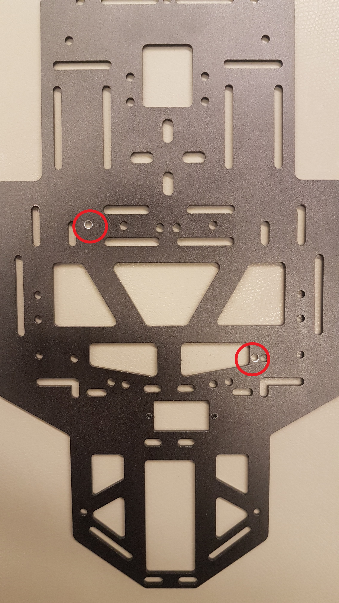
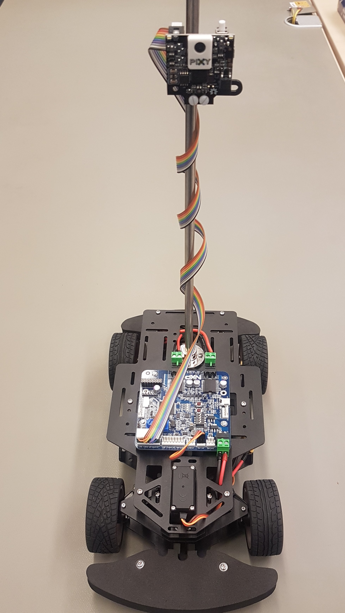

# RDDRONE-CUPK64 (AKA Micro E board or ARC board)


The top plate needs two more holes to fix the Micro E board. The additional holes are shown in the picture below (red marked). For the exact position of these holes, please measure it by yourself before you drill the holes.


The board can be fixed with six screws and three hexagonal spacers. Mount the hexagonal spacers with three screws at tree holes which are fit to the mounting holes of the MCU board. Then you can mount the board to the hexagonal spacers with the last three screws. It is best to mount the board so that the connections for the motors are at the rear and the battery connection at the front. 

The extension cable for the battery must now be pulled through a hole in the plate in front of the battery connection. This is best done before mounting the top plate to the chassis. The motor cables and the servo cable also should be pulled through the top plate before mounting the plate to the chassis. Finishing the mounting inside the chassis and on the top plate, you can fix the top plate with six screws to the hexagonal spacers.

Connect the battery cable and the motor cables to the connectors at the board as marked on the board. The Connector for the Servo is marked to. Connect the servo cable to the "Servo1" connector so that the ground connection (brown cable) is on the side of the "led(s)" connector. Mount the Pixy cable to the “LSC Camera1(spare)” connector. The ground connection is on the eighth pin. So the part with two cable right next to each other should be on pin 7 and 8. Compare with the picture below.

## Finished RDDRONE-CUPK64 (ARC Board) Setup

