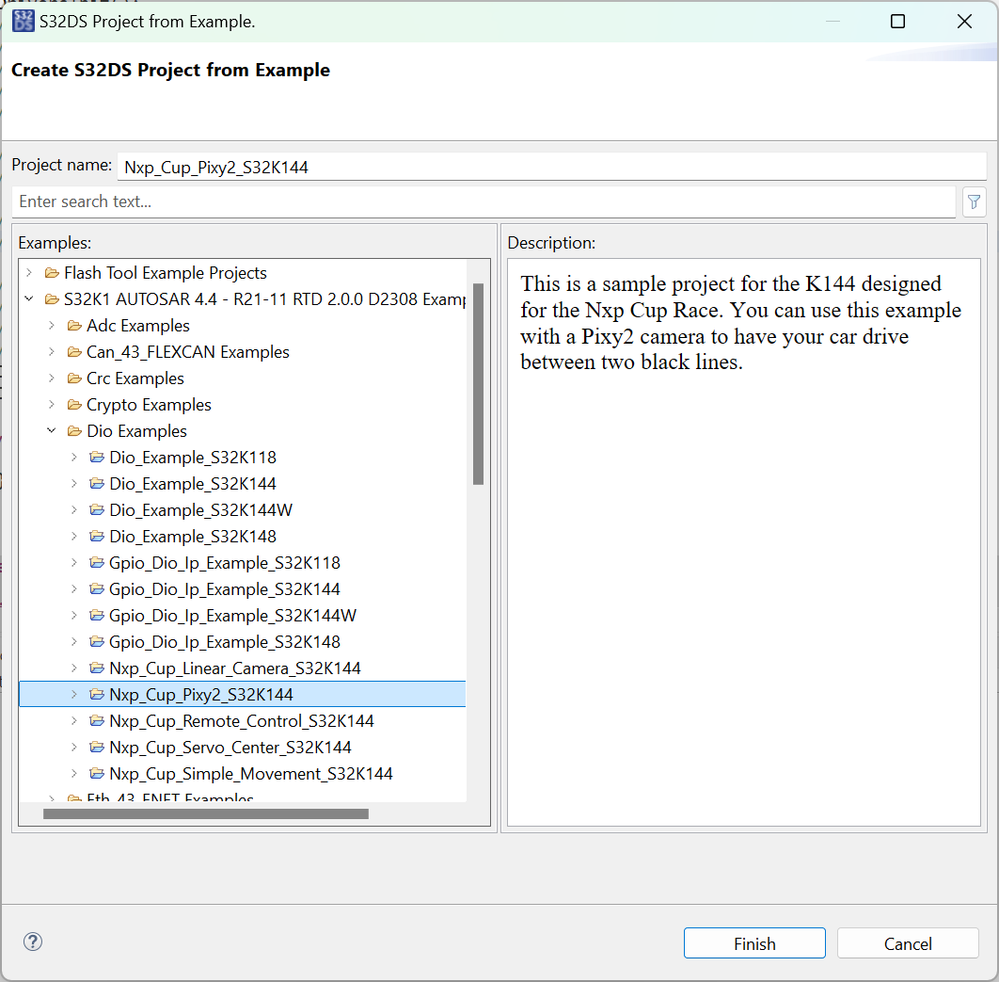

# Working with the example code

## Setting up a project for NXP Cup

Inside MCUXpresso, create a new project by going to "File", "New", and then "Project". A wizard will appear, in which you should select "New C/C++ Project" under "C/C++".   

The SDK wizard is shown now. Select the MK64FN1M0xxx12 in the tap "SDK MCUs". Then select the "frdmk64f" board under "Available boards." This board fits the best to the ARC Board. Now, press "Next >".

You can use any name, but for clarity, we will call it "NXPCUP_c++". As project type select "C++ Project". The other settings can stay that way. Now you can finish the project wizard.

## Including the example code


You can download the example code [here](https://nxp.gitbook.io/nxp-cup/downloads-and-links).


First delete the main-file, "NXPCUP_c++.cpp", from the "source" folder. You will copy a new main into the folder. Now you copy all folders and files from the example code to the "source" folder in the project. Your project tree should look like this:

## Writing your own code

The` nxpcup_ARC_c++` is your main-file. Here you can call your implemented functions. 

The software is based on a 3-layers model:

1.  **Interface Layer**

    The lowest layer is the one which interfaces the hardware peripherals.
2.  **Module Layer**

    The middle layer makes the peripherals work, using the interface layer. It controls the lighting luminosity, the acquisition of the image from the camera, the control of the motors through the HBridge, the control of the servomotor, the measure of the speed of each motor and the control of the wifi module.
3.  **Manager Layer**

    You can write your algorithm here by using the given file structure in the Applications folder.

## Build, Flash, Run and Debug

Within the Quickstart Panel you can build and debug the project.


Flashing and debugging the Micro E board requires a **JLink Debugger**! 

Connect the JLink to the connector **J13 **on the Micro E board.

The USB port cannot be used for programming!


Build the project first, then you can flash and run the project with the GUI Flash Tool. (see Picture below)

For debugging use the "Debug" button from the Quickstart Panel.

## More support

Further documentation and videos are available on the NXP website.





