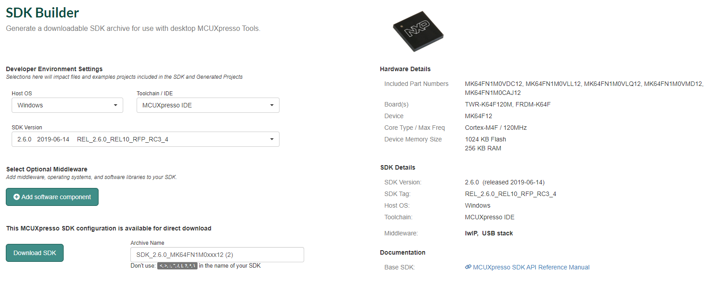

# Setting up MCUXpresso


This guide shows how to use MCUxpresso under Windows 10. Any other operating system is also possible.

There is nothing wrong with using the latest MCUXpresso software.


The first step is to actually download the MCUXpresso IDE. It is available free of charge from the NXP website, but you will need to create a \(free\) NXP account. Have a look at the link below.



## Building and installing the SDK for the MK64F12 processor

Go to the MCUXpresso SDK webpage and press the "Select Development Board" button. You might be asked to login to your NXP account again. The SDK webpage is available here:



You will be redirected to the MCUXpresso SDK Builder. Here you have to select the board or processor for which you want to build the SDK. You can use the "Search by Name" option, just start typing "MK64FN" and select "MK64FN1M0xxx12", which should be the only remaining option. Then, press the green "Build MCUXpresso SDK" button on the right.

In the next screen, select Linux as the host operating system, and make sure the toolchain is set to MCUXpresso. You can leave the other settings at their default values. Press the "Download SDK" or "Request build" button. You may see a screen showing that the SDK is being build. You now only have to download the SDK archive \(.zip file\). You might have to accept another agreement before the download starts. Download it from inside your VM, or transport it into your VM using the shared folder.

Now, start MCUXpresso within your VM. You can find it in the launcher menu. If you open it for the first time, it might ask you where to store its workspaces. You can chose your own directory, or leave the default as is. You can check the box to make sure you are not asked about it again. Once the IDE has started, find the location were you stored the SDK .zip file, and drag the whole file into the area of the IDE screen that says "Installed SDKs". It's usually located at the bottom. It will ask you to confirm that you want to import the SDK. Just press "OK". It might take a few seconds to install.

