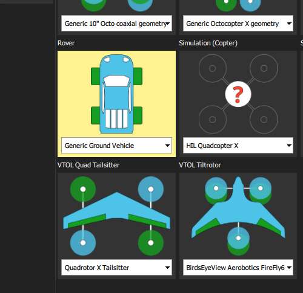

# Airframe

In the _airframe_ screen, under the _Rover_ configurations, select the _Generic Ground Vehicle_ airframe preset. The QGroundControl user guide provides more information on how you can select this airframe.



