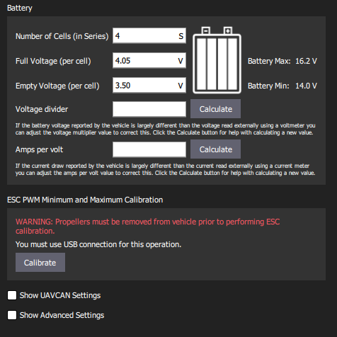

# Power

All relevant information is available in the QGroundControl documentation. Below we provide some more information about the different settings found on the Power page.



## Battery Percentage

For correct display of battery percentage, you should always specify the correct number of cells in the battery (indicated by 3S, 4S, etc. on the battery). You should also calculate the value for the voltage divider to calibrate the voltage readings coming from the power module. This can be done by measuring the voltage of the connected battery using a volt- or multi-meter, and inserting the measured voltage into the `Calculate Voltage Divider` prompt. Together, these settings will provide you with an accurate battery percentage while the drone is idle on the ground, so you can determine whether it is still safe to take off. PX4 also has a fail-safe that prevents arming when the battery percentage is too low.


If you don't have a multimeter, keep in mind that a fully charged 4S battery should have a voltage close to 16.8 V, and a 3S battery should be 12.6 V. When you have a fully charged battery connected, you could use those approximations because they would be very close to the actual value. This should give decent results in the end.


For a better indication of the battery percentage when the drone is flying, you should also calculate the  Amps per volt value: this will allow the software to calculate the battery voltage based on current draw, correctly taking high-load voltage drop into account. The calculation can be performed by measuring the current through the drone when it is idle, and inserting the value into the `Calculate Amps per Volt` prompt. After calculating the correct Amps per Volt value, the battery percentage will also be correct during flight. This will allow you to determine how much flight-time you have remaining during flight. It also allows you to make use of more advanced PX4 fail-safes based on battery percentage, such as automatically returning home and landing when the battery percentage gets too low.


It might not be easy to measure the current flow if you don't have the right tools. We have found that the whole system draws about 0.15 to 0.20A when disarmed (no motors spinning). You can use this to make an educated guess, which will give decent results if you are not able to perform the measurements.


If you still have issues with incorrect battery percentages, it is possible to manually specify the voltage drop under Advanced power settings. This voltage drop can be determined based on flight logs by looking at the difference in voltage when the drone takes off.

## ESC Calibration

To ensure that all motors correctly respond to commands coming from the FMU, you should perform an ESC "calibration". It makes sure that the ESCs are aware of the minimum and maximum PWM values that the FMU will provide. This can be done by pressing the ESC calibration button and following the on-screen prompts. The calibration process requires a USB connection, since it involves steps where you have to disconnect and reconnect the battery. 


You should always perform the ESC calibration. Uncalibrated ESCs can make your roverunable to drive. 


## PWM settings for the motor output 

The default settings for the PWM motor output do not work for the ESC supplied. Change the following parameter in QGroundControl:

In the parameter tab of QGroundControl go to "PWM Outputs". Than change

* **PWM_MAIN_DIS3** to **1485** us
* **PWM_MAIN_DIS4** to **1485** us
* **PWM_MAIN_FAIL3** to **1485** us
* **PWM_MAIN_FAIl4** to **1485** us
* **PWM_MAIN_MIN3** to **985** us
* **PWM_MAIN_MIN4** to **985** us

