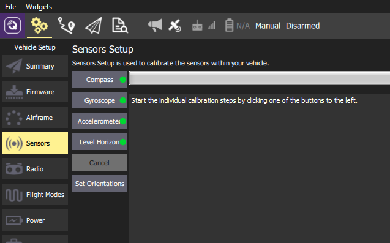
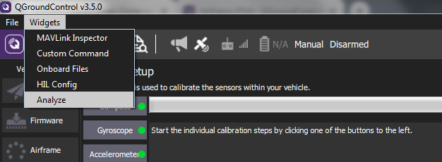

# Sensors

The _sensors_ screen lists most of the sensors that are available to the FMU \(internal or external\). It allows you to start the calibration process for the listed sensors. The QGroundControl user guide has all information you need about calibrating the sensors. This step is very important for stable flights, it is required to do the calibration at least once and it should be redone whenever the drone starts flying less stable!



You can check whether the sensors are properly calibrated using the _Analyze_ widget, which can be found under _Widgets_ at the top of the screen. This is a tool in QGroundControl that allows you to plot sensor values of sensors inside of the RDDRONE-FMUK66 in real-time.

You can check the calibration of the sensors inside of the FMU by putting the drone on a flat, horizontal surface, and looking at the _ATTITUDE.roll_ and _ATTITUDE.pitch_ variables. If they are larger than 0.02 \(both positive and negative\), you should consider recalibrating the Accelerometer, Gyroscope and Level Horizon. 


Note that the scaling of the graphs in the analyzer changes automatically! In some cases, very small changes might appear as if they are very large. Look at the current scale before drawing any conclusions!


