# Installing Ubuntu

## Installing Ubuntu to the virtual disk image <a id="installing-ubuntu-to-the-virtual-disk-image"></a>

When you run your virtual machine for the first time, you will be greeted by a screen that asks you to try Ubuntu or directly install it. You can also select a different language, if you want. We will start with directly installing Ubuntu.

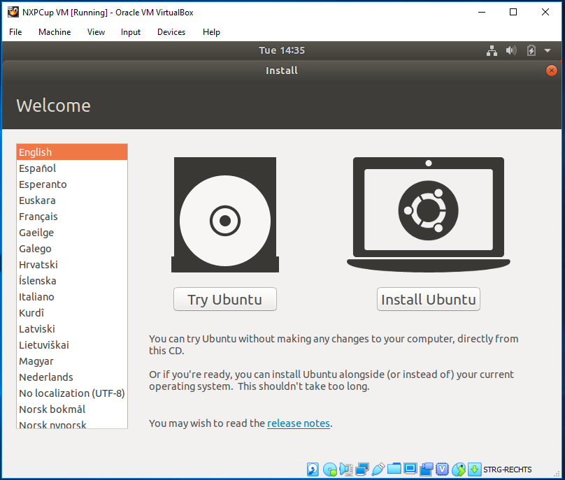

### Keyboard layout <a id="keyboard-layout"></a>

If desired, you can change the keyboard layout. Usually, the US layout works fine as well.

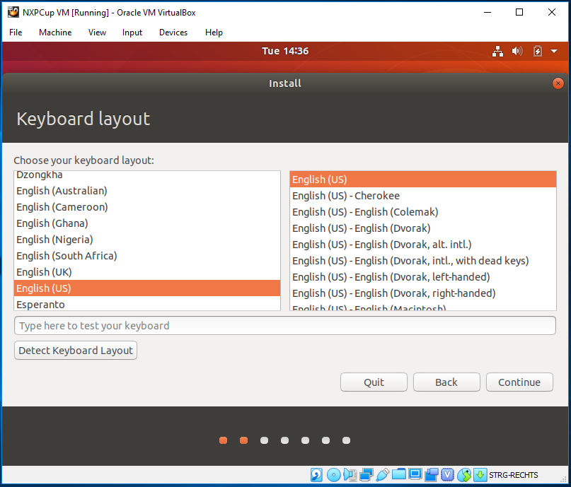

### Updates and other software <a id="updates-and-other-software"></a>

Choose a **minimal installation**. It is useful to also **install updates** and **third party software** while installing Ubuntu.

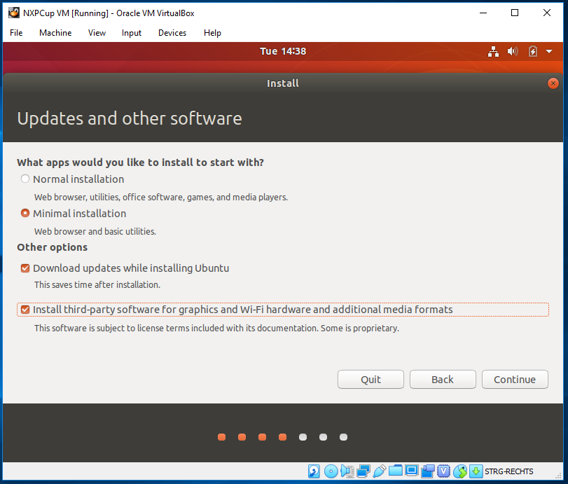

### Installation type <a id="installation-type"></a>

Choose to **erase the disk and install Ubuntu**. Don't worry, this will only "erase" your virtual hard disk image, not your actual hard drive. After pressing "**Install Now**", you might get a pop-up that asks if you want to write the changes to the disk, just press **continue**. After that, you might have to wait for a few minutes.


If you are installing Ubuntu **natively** you should do your own research about different installation types. If you have Windows installed on the same computer it will probably be detected by the Ubuntu installer and propose a dual-boot setup. This allows you to choose at boot between Windows and Ubuntu. However, this is beyond the scope of this GitBook.


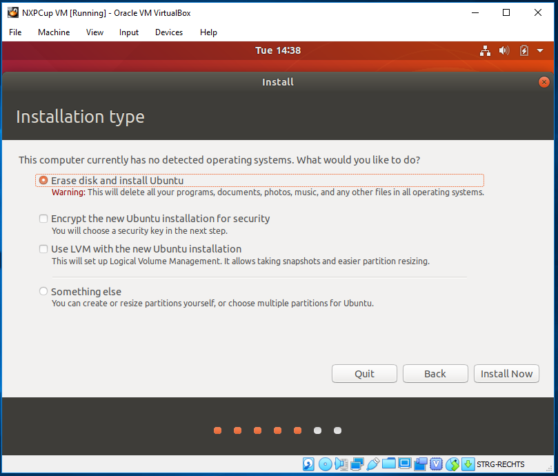

### Where are you? <a id="where-are-you"></a>

The next screen will ask for your location. The default will probably work fine, otherwise select the option that matches your current location the best.

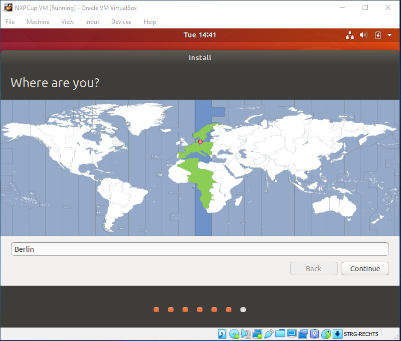

### Who are you? <a id="who-are-you"></a>

After this, you will be asked to set up a user account. For this virtual machine, we just use a generic name and password to make it easy to use. Fill in "NXPCup" for the **user account name** and the **computer name**. For the **username** and **password**, use the lowercase "nxpcup". You can also select the option to **log in automatically**.

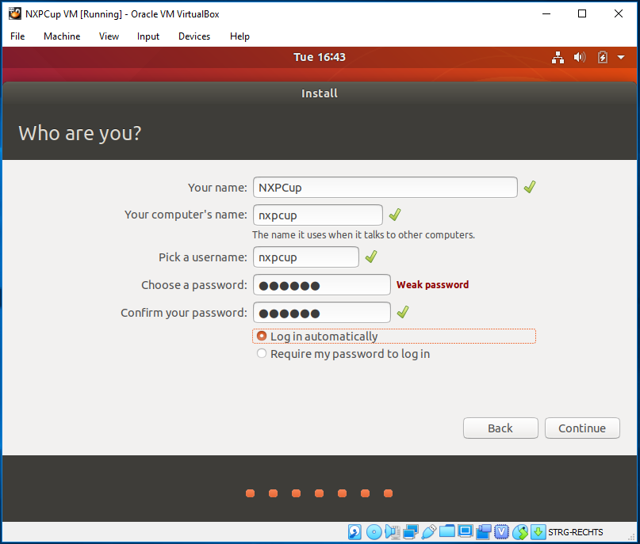

It will take a while to finish the installation. You might be asked to **restart** the virtual machine after the installation has finished, just restart it immediately using the button. During shutdown, Ubuntu might also ask to remove the installation medium. You can ignore this and **press the enter key**.

## First boot <a id="first-boot"></a>

When the system reboots, you will be greeted by a screen that shows what's new in this Ubuntu version. Just click "Next" at the top right until you are asked to **help improve Ubuntu**. You can **disable** it, if you want. Then just continue until you are done and see the desktop.

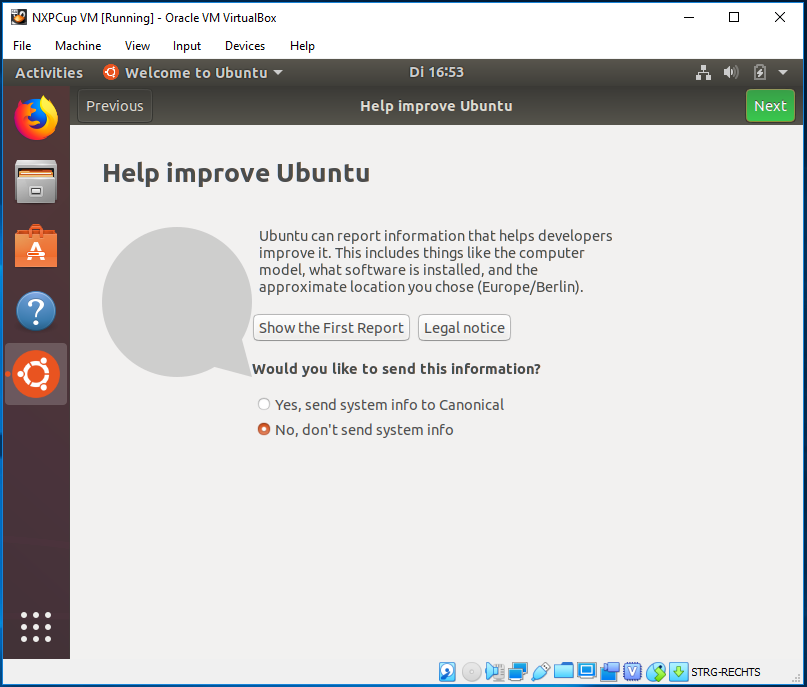

You might also get a popup from the software updater. It is recommended to **install these updates** now. You might be prompted to enter your password, which should be "nxpcup" \(lowercase\). After the updates are installed you might be asked to **restart** again. Just restart before we continue.

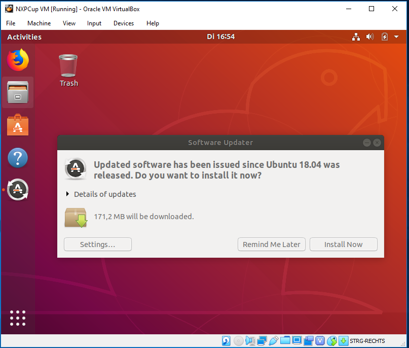

## VirtualBox Guest Additions <a id="virtualbox-guest-additions"></a>

After the reboot we will install the "VirtualBox Guest Additions", which are some packages that will provide better integration between your guest OS and host OS. Open a terminal window by going to the launcher menu \(the icon with the 9 dots at the bottom of the dock\) and search for the terminal application. Once you have it opened, don't forget to right click the terminal icon on the dock and add it to your favorites. You will be using the terminal often. You can also remove the "Help" and "Ubuntu Software" icons from the dock, because you will probably not use them much. You can always find them again in the launcher.

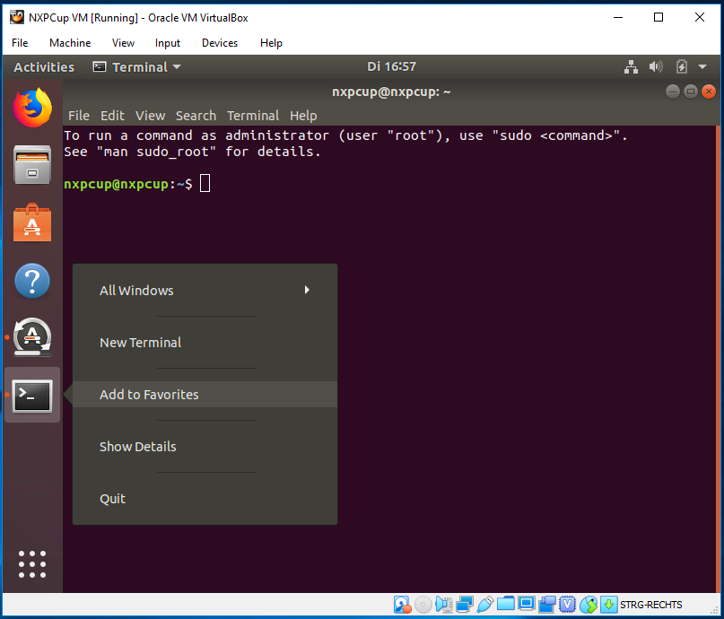


We should first update the package lists of the apt package manager with the following command:

```bash
sudo apt update
```

The term "sudo" stands for "superuser do" and runs the command that follows with superuser privileges \(administrator\). You will probably be asked to enter your password. The terminal does not show your password while you type it, so it might seem as if nothing is happening, but just enter your password and press enter.


Copying and pasting commands between your host and guest operating systems is not yet possible. You will need to enter a few commands yourself until we have installed the guest additions. After that you should be able to just copy the commands directly from these pages.


After the package lists have been updated, you will probably find that there are some updated packages available. We can install these updates with another command:

```bash
sudo apt upgrade
```

It will show you a list of packages that are going to be installed \(not necessarily the same as shown in the screenshot below\) and asks if you want to continue. You can press enter to select the capitalized default option \("Y" for "yes"\). Now it might take a while to finish.

Now, install the Guest Additions through the package manager using the command in the terminal:

```text
sudo apt install virtualbox-guest-dkms
```

You will probably be asked whether you want to install the packages or not. You should enter "y" \(for "yes"\) in the terminal and press enter. It might take a while to install.

The guest additions provided in the Ubuntu package repositories are probably not updated for the latest version of VirtualBox, so it might give some issues. However, it is still recommended to install this package because it will also automatically install some useful dependencies as well. To solve any last issues we can easily upgrade to the latest version of the guest additions. Go to the "Devices" menu and click on "Insert Guest Additions CD image". It will ask you whether you want to run the software, and may ask you to enter your password. It will then open a terminal window and start the installation.

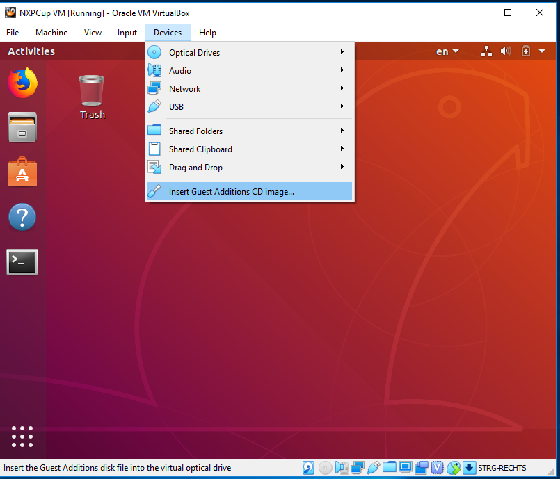

It will ask you whether you want to run the software, and may prompt you for your password. It will start a terminal window and may complain about some packages not being installed, but that should be no problem right now. Once the installation finishes, you can close the terminal window. After the installation is done, you should be able to maximize the virtual machine window, and the resolution of the Ubuntu desktop should scale with the screen size. Also, you should be able to use the shared clipboard. If it does not work yet, you might need to reboot the virtual machine again.

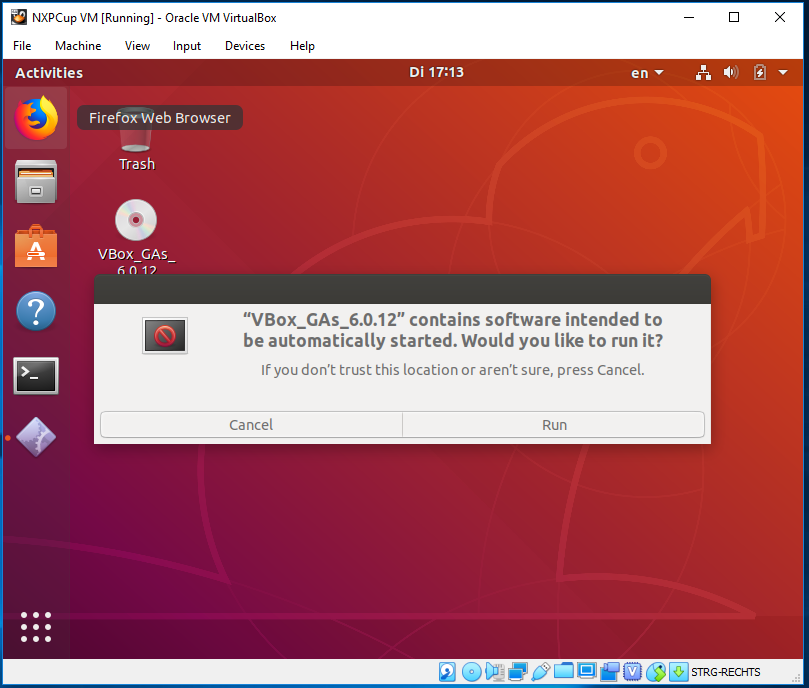

When the installation has finished, you can close the terminal. You can eject the guest additions disk image by right clicking on the icon on the desktop and selecting the eject option. Now that the guest additions are installed you should be able to maximize the virtual machine window, and the resolution of the Ubuntu desktop should scale with the window size. The shared clipboard should work as well. You might have to reboot the virtual machine again if it is not working.


You should redo the last step when you **update VirtualBox**. You can just go to the device menu, insert the guest additions image and run the installer again. This will install the new version.


## Shared folders <a id="shared-folders"></a>

To make the shared folder work, we also need to add our user account to the vboxsf group. Enter the following command in a terminal window \(assuming your username is "nxpcup"\):

```text
sudo usermod -aG vboxsf nxpcup
```

This will give you access to the shared folders. You might get asked for your password. You possibly have to reboot before it becomes active. If after a reboot the shared folder is still not visible from the file manager, you should check the virtual machine settings if the shared folder has auto-mount enabled.


## Some useful settings <a id="some-useful-settings"></a>

One of the last things to do, is to make sure that all relevant language packages are installed. This is especially useful when you did not select English as the default language. Open the launcher and look for "Language Support". It will immediately ask you to install the missing language packages.


Finally, in the launcher you can also find "Settings". Go to "Power" and set power saving to never. This prevents the VM screen from going black when it is not the active window. This is the last setting for now.

Your basic virtual machine should be fully operational and you can customize it to your liking. The next pages will show how to set up some useful development tools in the virtual machine.[  
](https://nxp.gitbook.io/hovergames/developerguide/tools/virtual-machine)

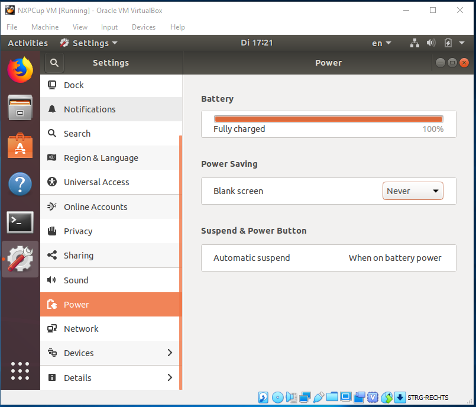

