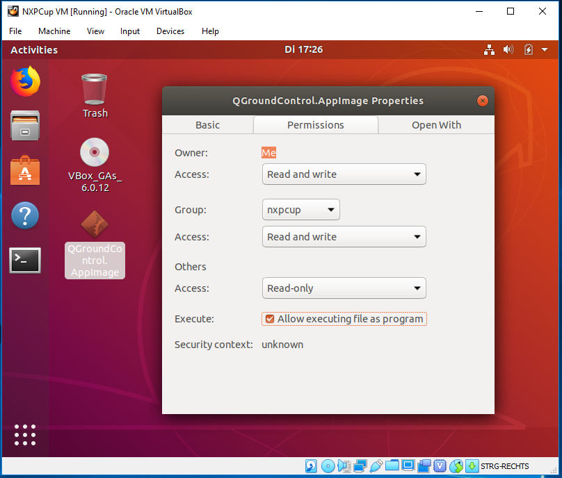

# PX4 Toolchain

To start building PX4 firmware from source, you should first install the PX4 toolchain. This provides you with all the tools required to develop, build and debug PX4 Autopilot, but the same tools are also often used for other software projects. You could directly install the toolchain on your main operating system, but we recommend to install it inside the virtual machine we created as described on the previous pages.

## Install Git

The minimal installation that we selected does not include Git by default. Git is a very popular distributed version-control system and you will probably use it a lot when developing software for the HoverGames.  It will also allow us to easily download \("clone"\) the PX4 code because it is available on GitHub, which is a Git-based source code hosting platform. 

So let's install Git using the following command:

```bash
sudo apt install git
```

## Download the PX4 source code

Before we install any tools we will download the PX4 source code. The PX4 developers have included a script that makes it much easier to install all required tools. Let's first create a folder to hold all sourcecode that we are going to work with. The following command creates the "src" folder in the user's home folder \(if it doesn't exist already\):

```bash
mkdir -p ~/src
```

The next step is to actually download the source code. We will use Git to create a local copy of the online repository that is hosted on GitHub. The following command first changes the working directory to the "src" folder that we just created, then it will "clone" the whole PX4 firmware repository, including submodules, in a new "px4-firmware" folder.

```bash
cd ~/src && git clone --recursive https://github.com/PX4/Firmware.git px4-firmware
```

Note that it will take a while to clone the whole repository. The PX4 source code should now be available in the `~/src/px4-firmware` folder. The tilde represents the current user's home folder within the file system. You can also browse to this location with the file manager.

## Install the toolchain

As already mentioned, the PX4 developers provide a bash script to easily install all the tools that you need to build the PX4 firmware. We already cloned the PX4 source code, so we can just change our working directory and run the script:

```bash
cd ~/src/px4-firmware && bash ./Tools/setup/ubuntu.sh
```

You should reboot the virtual machine after the installation is done.

## Make your first PX4 build

Make sure to reboot your computer after the toolchain installation is finished. Then change your working directory to the PX4 firmware repository again and start a build for the FMUK66 using the following command:

```bash
cd ~/src/Firmware && make nxp_fmuk66-v3_default
```

After the build process is done, you should be able to find `.bin`, `.px4` and `.elf` files in the `~/src/Firmware/build/nxp_fmuk66-v3_default` folder. We will later come back to building your own firmware binaries, when we set up an IDE \(integrated development environment\) to do it for us.

## Install QGroundControl inside the VM


QGroundControl is needed for the configuration and the cablibration of the FMU. Within QGC you can set the Frame, on which the FMU is mounted and calibrate sensors. An detailed explanation can be found [here](https://nxp.gitbook.io/nxp-cup/developer-guide/development-tools/rddrone-fmuk66-development/commissioning-the-rddrone-fmuk66/px4-configuration-using-qgroundcontrol).


It is also a good idea to install the latest daily build release of QGroundControl inside your VM. It generally works better with the latest features of PX4, that you might come across when you use the latest PX4 source code that might not have been released as a stable version yet. Also, it is easier to switch between different AppImages in Linux than it is to reinstall a different QGroundControl in Windows.

Links to the daily builds are provided in the QGroundControl documentation. Inside your VM you need the Linux version, which is provided as an AppImage:



You don't need to install an AppImage. You only need to make it executable and run it. Move the AppImage file to your homefolder. Then, right click on the file, go to the file properties, and give the AppImage permission to execute as a program.



Alternatively, you can make the file executable by running the command, assuming it is located in your home folder:

`chmod +x ~/QGroundControl.AppImage`

More information about using an AppImage is available in the QGroundControl User Guide:



You are now ready to continue to the next section\(s\), in which we will set up an integrated development environment \(IDE\) to edit, build and debug the PX4 firmware. You can choose to install either [MCUXpresso](https://nxp.gitbook.io/nxp-cup/developer-guide/development-tools/rddrone-fmuk66-development/setting-up-mcuxpresso) \(recommended\) or [Visual Studio Code](https://nxp.gitbook.io/nxp-cup/developer-guide/development-tools/rddrone-fmuk66-development/setting-up-visual-studio-code), but you can also install both to see which one you like best.

## Instructions from the PX4 Developer Guide

By following the steps provided above, you should be ready to build the PX4 firmware from source. In case you want more information, toolchain installation instructions are also available at the PX4 Developer Guide. **Note that you do not need to follow these instructions if you have already installed the toolchain according to the steps above.**



For Linux computers, you only need to install the `Pixhawk/NuttX (and jMAVSim)` version \(so follow the steps at [https://dev.px4.io/master/en/setup/dev\_env\_linux.html](https://dev.px4.io/master/en/setup/dev_env_linux.html) up to the `Snapdragon Flight` heading\).

For Windows computers, we recommend the Cygwin installation, which can be installed using the steps at [https://dev.px4.io/master/en/setup/dev\_env\_windows\_cygwin.html](https://dev.px4.io/master/en/setup/dev_env_windows_cygwin.html) up to the `Usage Instructions` heading. 

Another option for Windows users is to setup a Linux virtual machine and just install the Linux toolchain. That's exactly what we have done above, actually. The PX4 Developer Guide also provides a step-by-step guide for this: [https://dev.px4.io/master/en/setup/dev\_env\_windows\_vm.html](https://dev.px4.io/master/en/setup/dev_env_windows_vm.html)

Instructions for Mac OS are available as well, at [https://dev.px4.io/en/setup/dev\_env\_mac.html](https://dev.px4.io/master/en/setup/dev_env_mac.html).

