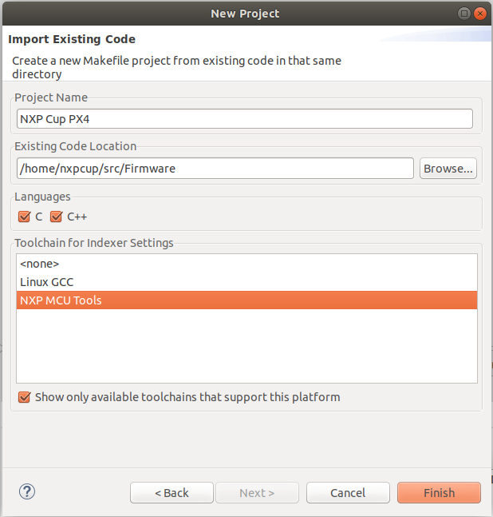
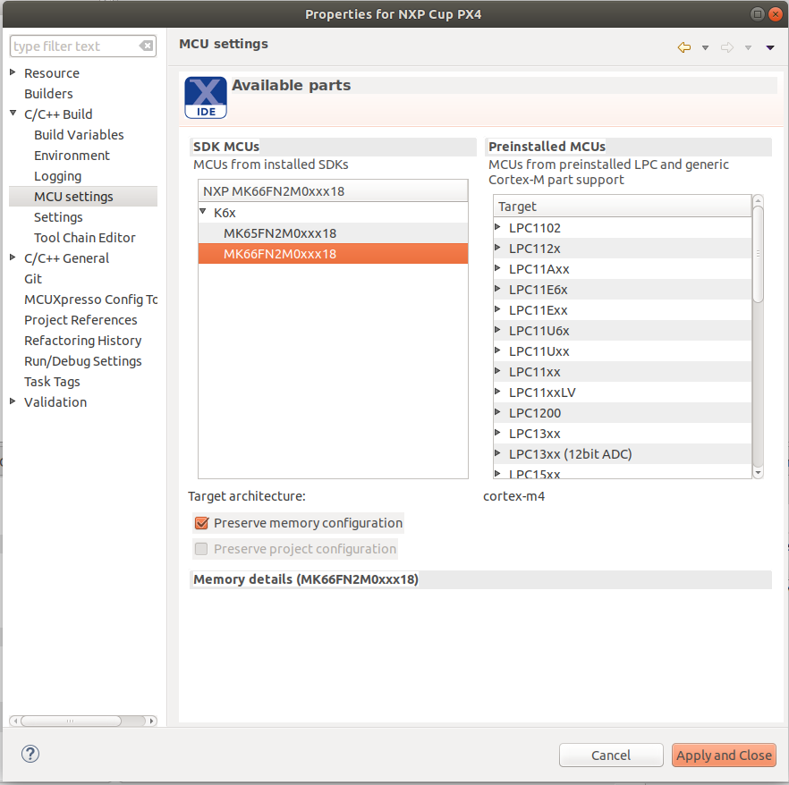
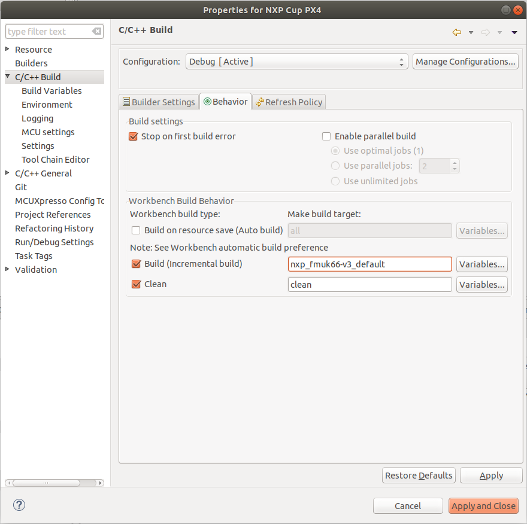
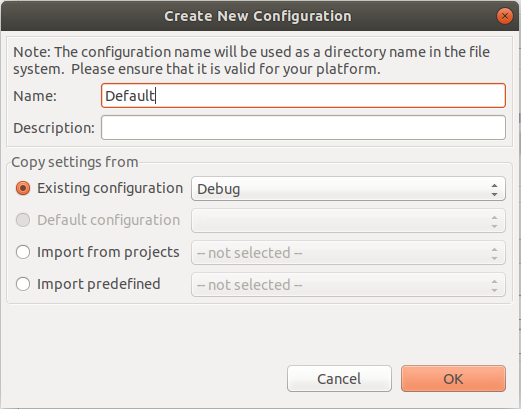
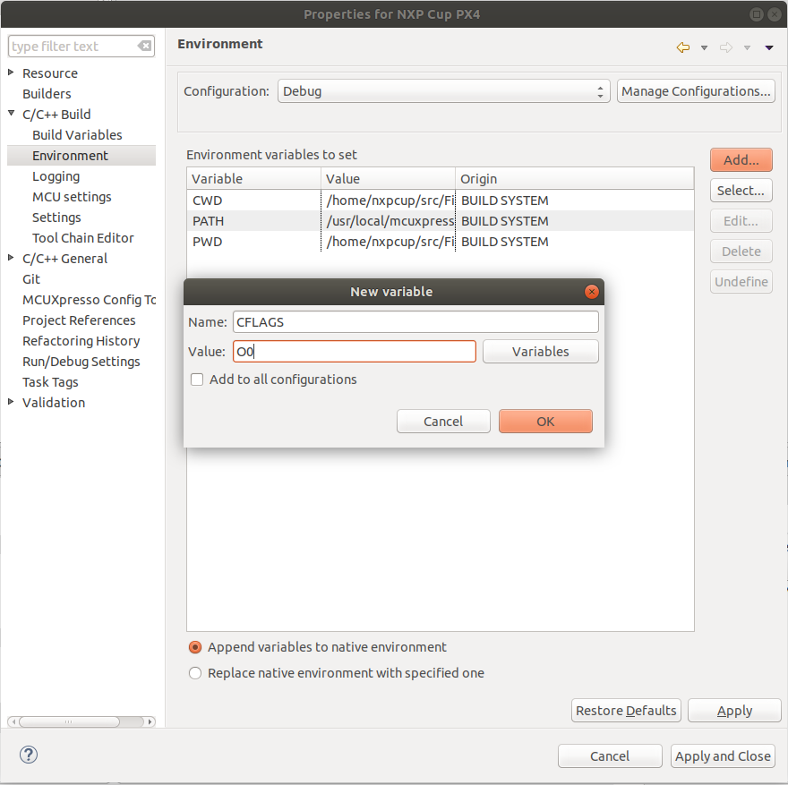
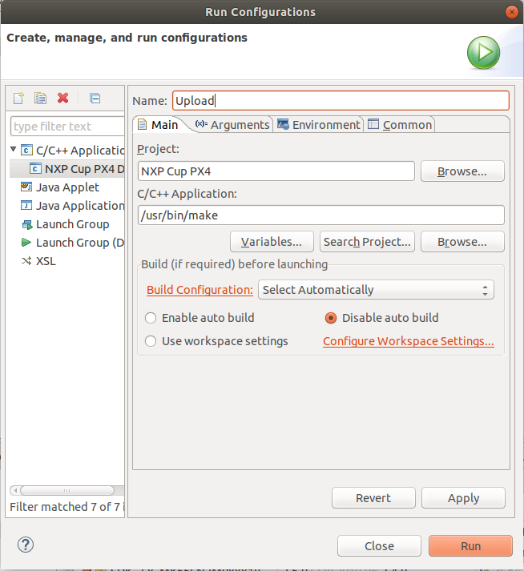
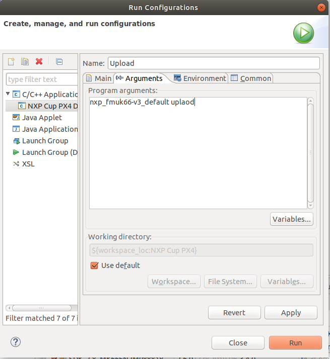
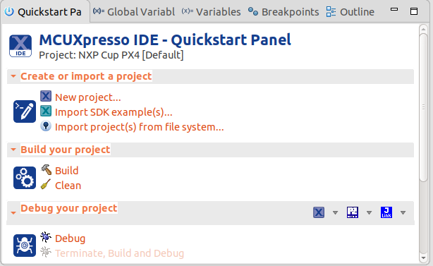

# MCUXpresso

## Installing MCUXpresso

We will install MCUXpresso inside the virtual machine \(or native Linux environment\). This allows us to let MCUXpresso build the PX4 firmware, flash it to the FMUK66 and debug the code while it is running on the board. You can also install MCUXpresso on your host operating system, but we recommend to keep everything in a Linux environment unless you know what you are doing. It will save you a lot of headache.

The MCUXpresso IDE is available free of charge and can be downloaded from the NXP website, but you will need to create a \(free\) NXP account:



Click on the download button and login to your NXP account. The next page will show the current available releases. There is also a tab for previous releases. You should download the current release \(11.1.1 as of June 2020\), click on "MCUXpresso IDE" to continue. You will have to agree with some terms and conditions before you can download the software.

Download the `.deb.bin` file for Linux. You can directly download it using the Firefox browser in the virtual machine or you can download it on your host operating system and move it into the [shared folder](https://nxp.gitbook.io/nxp-cup/developer-guide/development-tools/rddrone-fmuk66-development/installing-ubuntu#shared-folders).


Assuming you have the file stored in the `~/Downloads` folder, you should first enter the command below to allow the package to be executed and installed. You should replace the last part of the filename with the right version number for your download! You can use the auto-complete feature for this by pressing the tab key. Just start typing the command below and press tab when you get to the version number in the file name.

```bash
chmod +x ~/Downloads/mcuxpressoide-xx.x.x_xxxx.x86_64.deb.bin
```

Now you can install MCUXpresso by executing the installer package, for which you again have to modify the filename to match the right version:

```bash
sudo ~/Downloads/mcuxpressoide-xx.x.x_xxxx.x86_64.deb.bin
```

You might get asked to accept an agreement \(use the arrow keys to select "Yes" and press enter\). Then wait for the installation to finish. After everything is completed, you can find the MCUXpresso application through the launcher. Look for the blue icon with the "X", or search for "MCUXpresso".


## Building and installing the Kinetis K66 SDK <a id="building-and-installing-the-kinetis-k66-sdk"></a>

The MCUXpresso IDE by default only contains SDK support for a few microcontrollers. You must install additional SDK packages for most micocontrollers. The Kinetis K66 that is found on the FMUK66 board is not available by default, so we will have to install its SDK package.

Go to the MCUXpresso SDK Builder linked below. If you **click on "Select Development Board"** you will be taken to a page where you can select the Kinetis K66 microcontroller and put together an SDK package. You might need to **login** again to your NXP account.



You have to select the processor for which you want to build the SDK. The easiest is to use the search field. Just start typing **"MK66FN"** and select **"MK66FN2M0xxx18"** under processors. Then, **press the green "Build MCUXpresso SDK" button on the right**.


On the next page, select **Linux as the host operating system**, and make sure the toolchain / IDE selection is set to **"MCUXpresso"** \(or "All toolchains" if you want to use the SDK also with other tools\). You can leave the other settings at their default values, but feel free to include additional features if you want to. 

**Press the "Download SDK" button** when you are done. You might have to accept another agreement. The download should start immediately after that, but in some cases you might need to click on "Download SDK Archive". Download the SDK directly from your VM, or use the shared folder feature.


Now, start MCUXpresso within your VM. You can find it in Ubuntu's **launcher menu**. MCUXpresso will immediately ask at what location the **workspace** should be saved. You can chose your own directory, or leave the default as is. You can also create additional workspaces if you want.

You will be greeted by a welcome screen. You can **close the "Welcome" tab** or **press the "IDE" button on the top right** to continue. Once you are in the main view of the IDE, find the location were you stored the Kinetis K66 SDK .zip file, and **drag the archive** into the area of the IDE window that says "Installed SDKs". It's usually located at the bottom. It will ask you to confirm that you want to import the SDK. Just press "OK". It might take a few seconds to install.


## Create a new project for PX4 <a id="create-a-new-project-for-px4"></a>

Now that MCUXpresso and the Kinetis K66 SDK are installed, we can continue and create a PX4 project. You can create a new project in MCUXpresso by going to **"File", "New", and then "Project"**. A list with different project types will appear, from which you should select **"Makefile Project with Existing Code"** under "C/C++".


You can use any project name, but for clarity we will call it "HoverGames PX4". You should select `/home/hovergames/src/px4-firmware` as the **existing code location**. This is the folder where we cloned the PX4 firmware code. Make sure that both the C and C++ languages are selected. For "Toolchain for Indexer Settings", select **"NXP MCU Tools"**. Click "Finish" to create the project.



## Project Properties <a id="project-properties"></a>

Before we continue we should change some project properties. **Select the project** we just created on the left side of the screen, go to **"Project"** in the menu at the top and then select **"Properties"**.

Go to **"MCU Settings"** under "C/C++ Build". An error _might_ pop up, complaining about invalid values. If this happens you can close the error, switch to another tab and switch back again. You should now see the same screen as shown in the image below. On this "MCU Settings" screen, select the **MK66FN2M0xxx18** under the K6x family of MCUs.



Now go to the main "C/C++ Build" tab. Uncheck "Use default build command" and change the build command to just `make`. The PX4 build scripts will take care of the specifics, we should not supply any additional arguments here.


Then switch to the "Behavior" tab. Uncheck "Enable parallel build", because the PX4 build tools also already takes care of this. Set the "Build \(incremental build\)" target to `nxp_fmuk66-v3_default` and change the "Clean" target to `distclean`. Click "Apply" to apply all changed settings.



At the top of the window, you can press the button "Manage Configurations...". Create a new configuration named "Default", make it a copy of "Debug". Select the newly created configuration, and make it active using the "Set Active" button.



You can press "Apply and Close" to apply the changes and close the window.

In the properties window, make sure "Debug" is still selected as the profile of which you are editing. Now switch to the "Environment" tab under "C/C++ Build". Add a variable named "CFLAGS" with value `O0` \(the capital letter O and a zero\). Make sure you DO NOT select the checkbox to add the variable to all configurations. After you have done this, you can press "Apply and Close", we are done in this window.



## Run Configurations <a id="run-configurations"></a>

At the top of the screen, you have a green "Run" icon. Click on the small arrow next to it, and select "Run Configurations...". In the window that opens, select "C/C++ Application" and click the "New" button above it. Name the newly created configuration "Upload", and change the "C/C++ Application" to `/usr/bin/make`. Also select "Disable auto build".




Also go into the "Arguments" tab and add `nxp_fmuk66-v3_default upload` into "Program arguments".



Finally, go into the "Common" tab. Tick the checkbox in front of "Run" under "DIsplay in favorites menu". Press apply and close the window.


## Debug Configurations <a id="debug-configurations"></a>

Make sure you still have the right project selected on the left. Also make sure your J-Link debugger is plugged in and correctly passed through to your VM \([verify that you added the J-Link debugger in the USB tab of the VM settings](https://nxp.gitbook.io/hovergames/developerguide/tools/virtual-machine#virtual-machine-settings)\). Now in the bottom left of your screen, in the quickstart panel, press the blue bug icon with the label "Debug".



A new window opens and should show the attached J-Link debugger. Select it and press "OK".


In the next screen, you should make the "Name" column a bit wider and select "nxp\_fmuk66-v3\_default.elf". Then, press "OK". It might start building the code and start a debug session. Wait for it to finish \(there is an indicator at the bottom\), and then press the button in the top bar with the two red squares, to stop all debugging sessions. It might also give an error and stop by itself.


We first need to change the configuration. Click on the small arrow between the green debug icon and the green run button. Go to "Debug Configurations...".


Under "GDB SEGGER Interface Debugging", select the generated JLink configuration. Rename it to "NXPCup PX4 JLink Debug". In this same screen, make sure "nxp\_fmuk66-v3\_default.elf" is selected in the field under "C/C++ Application". Then, under "Build Configuration", select "Debug" from the dropdown menu.


Switch to the "Common" tab, and tick the checkbox in front of "Debug" under "Display in favorites menu". Press "Apply" and close the window.


##  <a id="upload-firmware-to-the-fmuk66"></a>

## Upload PX4 firmware to FMUK66 using USB

If you want to do a clean build, press the clean button on the right side first. Then, click the hammer button to build to build the PX4 firmware for the FMUK66. You can check that the build configuration is set to "Default" by clicking on the dropdown menu next to the hammer icon. After you start the build process, the progress will be shown in the console at the bottom of the screen.

You can upload the firmware with the green "run" icon \(not to be confused with the "resume" icon that you can use during debugging\). You can again check that you have the right run configuration selected by clicking on the dropdown menu next to the run icon. Keep in mind that the FMUK66 needs to be connected via USB for this to work!


If this does not work, make sure you have the FMUK66 plugged in to your computer and that there are two FMUK66 devices "passed through" to the virtual machine. One for the bootloader, and one for "normal operation". 

Also make sure that the board actually has a [bootloader installed](https://nxp.gitbook.io/nxp-cup/developer-guide/development-tools/rddrone-fmuk66-development/commissioning-the-rddrone-fmuk66/programming-fmuk66-for-first-use#programming-the-bootloader).


## Upload non-optimized firmware and start debugging session <a id="upload-non-optimized-firmware-and-start-debugging-session"></a>

You can start debugging by clicking the green bug icon, or click on the small arrow to the right of it and select the "NXPCup PX4 JLink Debug" configuration.


You can stop all debug sessions with the button with the two red squares.


## Learn more about MCUXpresso

Further [documentation](https://www.nxp.com/design/software/development-software/mcuxpresso-software-and-tools/mcuxpresso-integrated-development-environment-ide:MCUXpresso-IDE?&tab=Documentation_Tab) and [videos](https://www.nxp.com/design/software/development-software/mcuxpresso-software-and-tools/mcuxpresso-integrated-development-environment-ide:MCUXpresso-IDE?tab=Design_Support_Tab) about MCUXpresso are available on the NXP website. You will probably have to login to access some files and videos. You can [create an account for free](https://www.nxp.com/webapp-signup/register).

The "Advanced Debugging with MCUXpresso IDE" series provides a great introduction to the debugging tools in MCUXpresso. Most of the tools shown in these videos can be directly applied to debugging an FMUK66 board running PX4 Autopilot.

**Advanced Debugging with MCUXpresso IDE**

* [Part 1: Building Debugging and Direct Flashing](https://www.nxp.com/design/training/advanced-debugging-with-mcuxpresso-ide-part-1-building-debugging-and-direct-flashing:TIP-ADVANCED-DEBUG-MCUXPRESSO-IDE-1)
* [Part 2: Accessing Data and Peripherals](https://www.nxp.com/design/training/advanced-debugging-with-mcuxpresso-ide-part-2-accessing-data-and-peripherals:TIP-ADVANCED-DEBUG-MCUXPRESSO-IDE-2)
* [Part 3: Code & Data Breakpoints](https://www.nxp.com/design/training/advanced-debugging-with-mcuxpresso-ide-part-3-code-data-breakpoints:TIP-ADVANCED-DEBUG-MCUXPRESSO-IDE-3)
* [Additional ](https://www.nxp.com/design/training/advanced-debugging-with-mcuxpresso-ide-part-4-instruction-trace:TIP-ADVANCED-DEBUG-MCUXPRESSO-IDE-4)[videos](https://www.nxp.com/design/training/advanced-debugging-with-mcuxpresso-ide-part-5-freertos-task-aware-debug:TIP-ADVANCED-DEBUG-MCUXPRESSO-IDE-5) are [available](https://www.nxp.com/design/training/advanced-debugging-with-mcuxpresso-ide-part-6-swo-trace:TIP-ADVANCED-DEBUG-MCUXPRESSO-IDE-6) in this series, but are outside the scope of the NXP Cup.

[  
](https://nxp.gitbook.io/hovergames/developerguide/tools/px4-toolchain)

