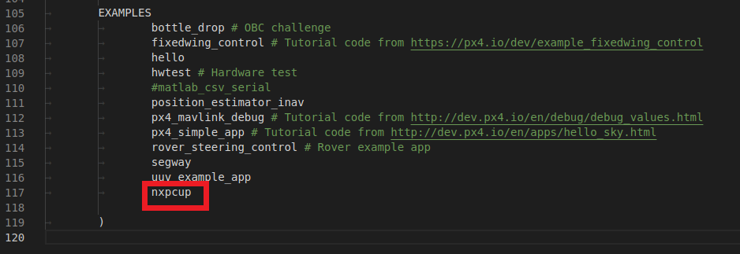
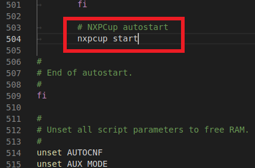

# Working with the Example-Application

## Architecture of the example


There is a basically example for programming called **nxpcup**. How to include the example and starting the code is explained in the next section. The structure of the example is based on thread programming. The example can be executed and you have access to the shell \(e.g. call the help function, read out other PX4 functions\).

In the folder are some files for the PixyCam driver. All files with the name “Pixy2..” in it do not have to be modified. The whole API for line tracking and block detection can be used.



## Including the example


You can download the example code [here](https://nxp.gitbook.io/nxp-cup/downloads-and-links).


The folder **nxpcup** has to be copied to the `~/src/examples` directory. In order to compile `nxpcup`, it has to be added in the file `~/boards/nxp/fmuk66-v3/default.cmake`. Below the `EXAMPLES` statement, the command `nxpcup` has to be added.



The application should be executed automatically. Therefore insert the command `nxpcup` start before the comment `#End of Autostart` in the file `ROMFS/px4fmu_common/init.d/rcS`.



This example is intended to be used without an RC control. Therefore a few changes have to be made. First arming with the Safety Switch should be enabled. This enables stating all driving functionalities by pressing the Safety Switch.


**Attention - Danger**

Changing this functionality is on own risk. Do not use this in combination with a drone. This starts the motors after pressing Safety Switch and in case of using a drone propellers can start and can cut you. So please just use this in for Rovers.


In the file `~/src/modules/commander/Commander.cpp` a few lines of code have to be added. Search for the following code:

```text
/* update safety topic */
if (_safety_sub.updated()) {
	const bool previous_safety_off = _safety.safety_off;
    if (_safety_sub.copy(&_safety)) {
        // disarm if safety is now on and still armed
        if (armed.armed && _safety.safety_switch_available && !_safety.safety_off) {
    
            bool safety_disarm_allowed = (status.hil_state == vehicle_status_s::HIL_STATE_OFF);
    
            // if land detector is available then prevent disarming via safety button if not landed
            if (hrt_elapsed_time(&_land_detector.timestamp) < 1_s) {
```

Now add the following code after the line `if (_safety_sub.copy(&_safety)) {`

```text
// arming only with safety switch if vehicle type is rover and RC control mode is "Joystick/no RC checks"
if (_safety.safety_switch_available && _safety.safety_off && (status.rc_input_mode == vehicle_status_s::RC_IN_MODE_OFF)) {
    bool safety_arm_allowed = (status.vehicle_type == vehicle_status_s::VEHICLE_TYPE_ROVER);
    if (safety_arm_allowed) {
        if (TRANSITION_CHANGED == arm_disarm(true, true, &mavlink_log_pub, "Safety button")) {
            _status_changed = true;
        }
    }
}
```

The code should follow with

```text
// disarm if safety is now on and still armed
if (armed.armed && _safety.safety_switch_available && !_safety.safety_off) {
```

Last but not least run a `make nxp_fmuk66-v3_default`. And run `make nxp_fmuk66-v3_default upload` to flash your FMUK66.

A last change has to be made in QGroundControl. Open this application and connect the rover to it. Now go to settings and then to parameters. Search for "COM\_RC\_IN\_MODE" and set value to "Joystick/No RC Checks" and disable the parameter "NAV\_RCL\_ACT".

After building and uploading the new code, the rover starts driving by pressing the safety switch.

## Building and uploading the firmware

Now, you can start building firmware. As part of the installation, the firmware has already been cloned to your computer under the folder `~/src/Firmware`. To build the firmware for RDDRONE-FMUK66 \(NXPhlite\), open a terminal in this folder \(On Windows, follow steps 1. and 2. at [https://dev.px4.io/en/setup/dev\_env\_windows\_cygwin.html\#getting\_started](https://dev.px4.io/en/setup/dev_env_windows_cygwin.html#getting_started)\), and use the following command:

```text
make nxp_fmuk66-v3_default
```

This will create a firmware file called `nxphlite-v3_default.px4`, which can be found at `~/src/Firmware/build/nuttx_nxphlite-v3_default`. This is the firmware file based on the current master, which can already by uploaded to the RDDRONE-FMUK66 using QGroundControl. 

You can also have the building process directly upload the firmware to the FMU. To do this, run the following command:

```text
make nxp_fmuk66-v3_default upload
```

This will also build the current version of the firmware, but when it is finished building it will also upload the firmware to a connected RDDRONE-FMUK66. If you do not have an FMU connected or the uploader does not recognize a connected FMU, it will display a message that it is waiting for a "Bootloader". If you have not connected the FMU yet, the uploading will commence whenever you plug it in. If the FMU is already connected, you can try resetting the FMU using the reset button on the side.

## Functionality of this module

The main function of the nxpcup creates a instance of the Pixy 2 and initializes it. The uORB topics for safety and RC input are subscribed and an instance to publish actuator controls is made. If the initialization of the Pixy was successful, the version is printed. And a endless-while loop starts. Within this loop the information about the detected lines are called from the Pixy 2. Here all line are requested. Only the main vector can be requested, but since you want to drive between two lines, all lines are required. For starting the function the safety switch must be activated. Then the rover is set to attitude control, other control modes are disabled now and the function `roverControl raceTrack(Pixy2 &pixy)` \(the algorithm\) is called. This function returns a struct with the values for steering and speed of the motors. In the default version steering is statically set to 30 degree and speed is set to 10% forward. If the Safety Switch is deactivated the values of speed and steering are set to zero and manual control is enabled again. The struct with the motor values are passed to the function `void roverSteerSpeed(roverControl control, vehicle_attitude_setpoint_s &_att_sp)`. This function converts the `motorControl` values to attitude set points. The attitude set points are published within the loop in the main function. The loop always proofs if this thread should be exited.

## User Interface

The application `nxpcup` can be started and stopped via the console. You can also request the status of the application. You need a serial cable like a FTDI-USB-UART-3v3 for communicating with the FMU. Working under Windows you need a program like “[PuTTY](https://www.putty.org/)” to connect with the FMU. Under Linux/ubuntu you can use “screen”. A second possibility to communicate with the FMU is via QGroundControl. For that you can connect a Telemetry device or the USB cable. In QGroundControl you have to use the MAVLink console. Within this interface only PX4 messages are displayed. For using commands like `printf()` in case of debugging use the serial cable and a console. With the command help all applications are listed. You should find the command `nxpcup`. To start the application _nxpcup_ type `nxpcup start`. To get the status of _nxpcup_ enter `nxpcup status` to the shell and to stop enter the command `nxpcup stop`. The user interface is good for getting additional information about the status of the FMU and its processes. 


For the final program the safety switch is all you need to start and stop the race.

Activate the Safety Switch for starting the race and deactivate the switch for stopping the motors. 

After activating the Safety switch the rover starts driving \(depending on your implemented algorithm\)


## Writing your own code

The example is prepared so that you only need to implement your algorithm in the `nxpcup_race.cpp` function. Insert your code here, build and upload your firmware again. Now you can drive with you own program!

