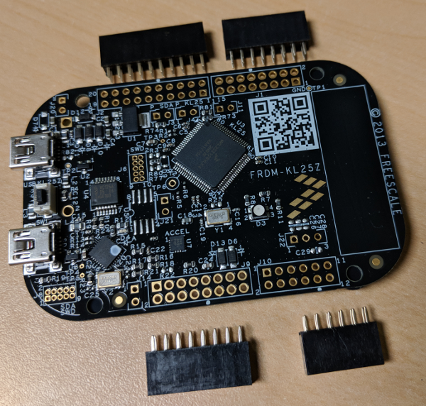

# Circuit Boards

First, you should check your Circuit Board. At the end, the boards should be stacked together as shown in the last picture. There is a double row pin socket on the bottom of the System Board. This socket should be connected with the pins of the Motor Driver Board.

The FRDM KL25 will need pin sockets installed on the bottom side in order to mate with the System Board. You can find a detailed instruction on the next page.

After installing the pin socket on the FRDM KL25, the board can put the  FRDM KL25 and the System Board together.

For now it makes sense to dismantle the boards once again. This makes it easier to mount the Power Board on the Chassis.

