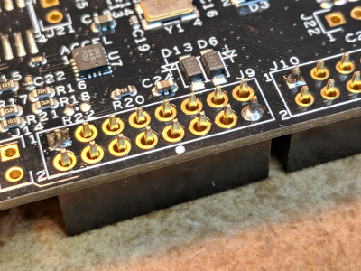
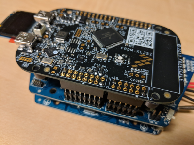
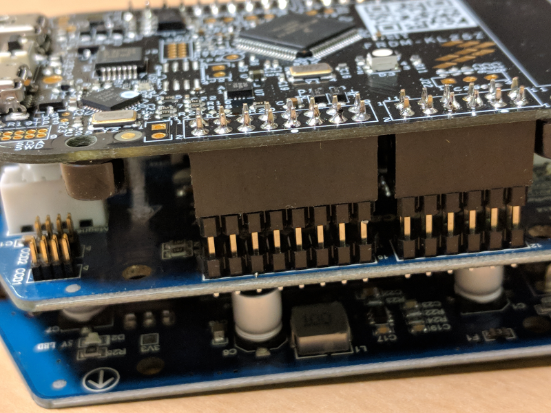

# Adding Headers to FRDM-KL25Z

The FRDM-KL25Z does not come with any socket headers in the expansion connector areas. It requires socket headers to be added to the underside of the board.

The parts needed are as follows \(or similar equivalent\)

* 1x 12 position \(2 row x 6 pin\) 0.100"x0.100" Dual row socket. 
  * [Mouser part number for 6 pin](https://ca.mouser.com/ProductDetail/3M-Electronic-Solutions-Division/929975-01-06-RK?qs=%2fha2pyFadug3xavb3impxToo7%2bxeZqJc8FDQDpBwxY8fymqYGLk70A%3d%3d) 
* **2**x 16 position \(2 row x 8 pin\) 0.100"x0.100" Dual row socket. 
  * [Mouser part number for 8 pin](https://ca.mouser.com/ProductDetail/3M-Electronic-Solutions-Division/929975-01-08-RK?qs=%2fha2pyFaduh65k0%2bENFIKM0O%2bLwEl%2b0UIf0KCh7NaaF0Lacmigo6kOuIdr4u%2fKbj)
* 1x 20 position \(2 row x 10pin\)  0.100 "x0.100" Dual row socket. 
  * [Mouser part number for 10 pin](https://ca.mouser.com/ProductDetail/3M-Electronic-Solutions-Division/929975-01-10-RK?qs=%2fha2pyFaduh65k0%2bENFIKByEbwIGLi9kanupCElhNNyVcD3udA10fqWc5QcC0FDr)

\*\*Note these are quite standard parts, and any equivalent sockets will work. You may also be able to purchase a "breakaway" type that allows you to cut a larger strip down to the sizes you need.

It is good practice to when soldering on the socket headers to only tack the two opposite corners. \(The headers go on the bottom remember!\) This allows checking that the socket headers are flat to the board, and align well to the underlying headers.

## Tack the two corners so that the sockets are flat.

## Good to also check that the headers align well to the headers on the System Boards

## Then finish soldering the remaining pins

## Completed soldered and assembled board stack.

