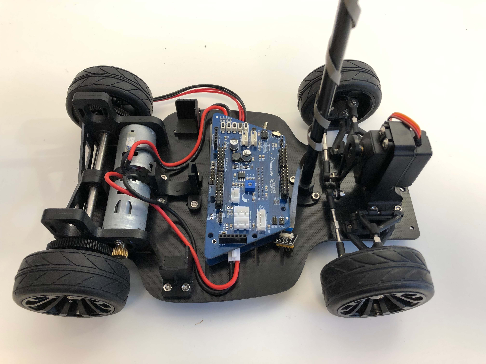
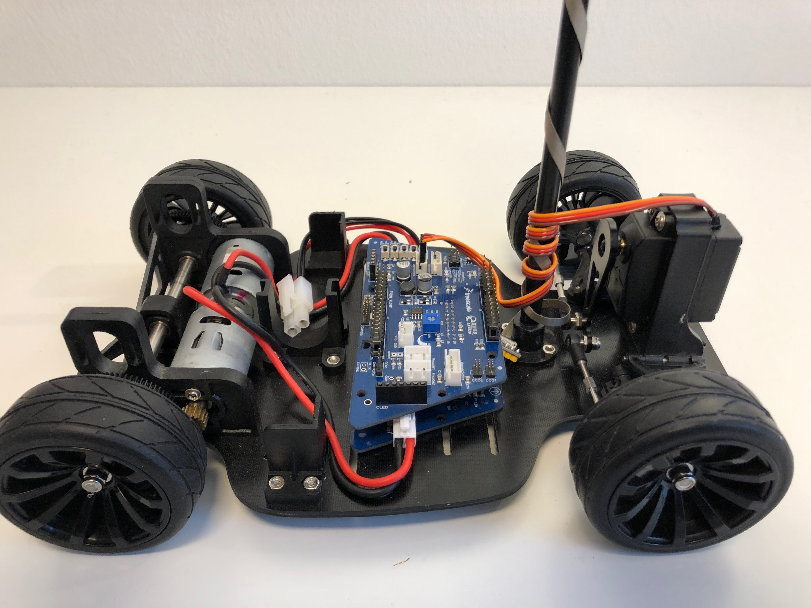
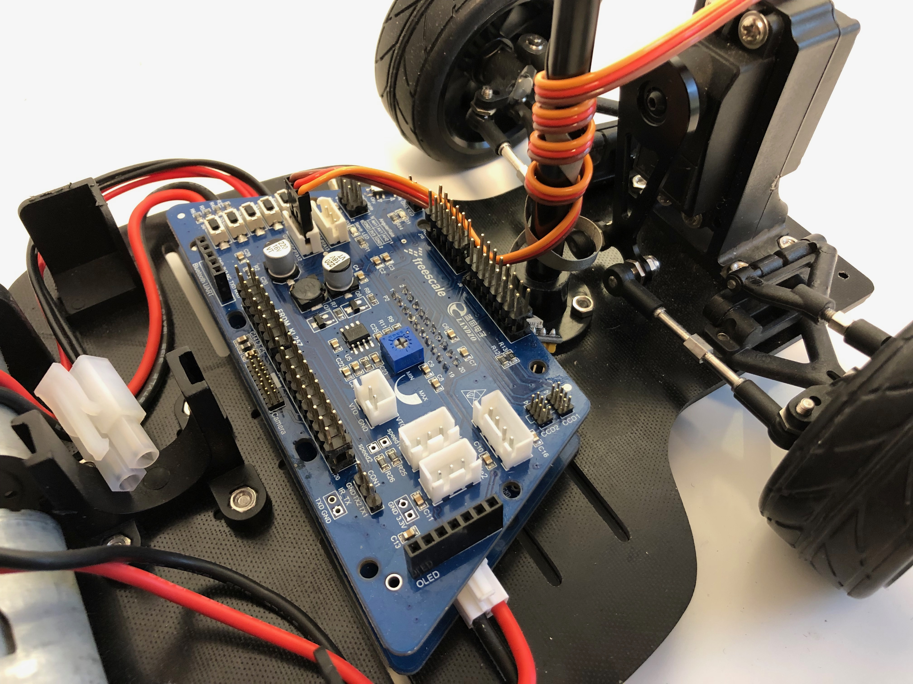
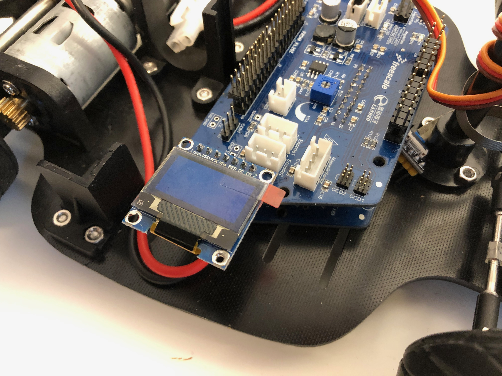
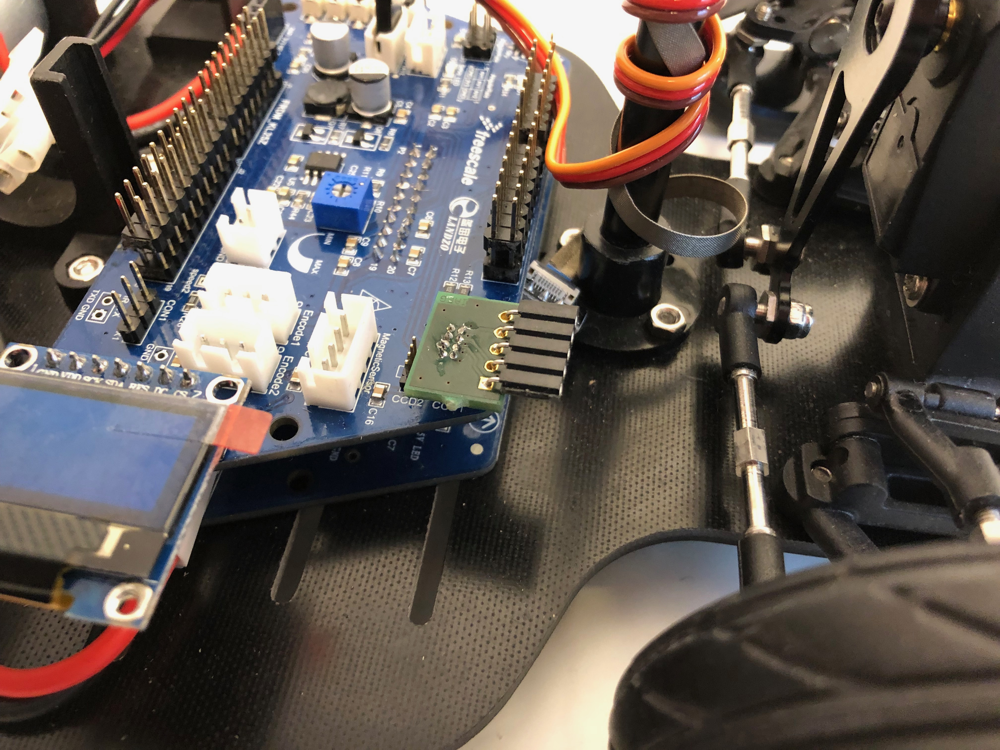
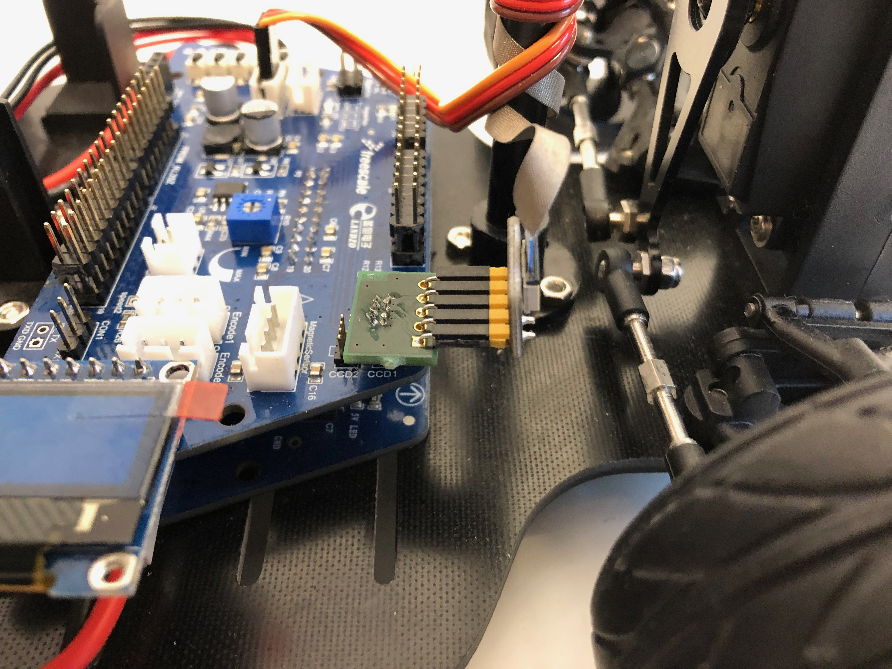

# System Board, Servo and OLED

## System Board

Put the System Board over the Motor Driver Board. Use some board spacer to fix the system board. 

## Servo Connection 

Connect the Servo cable with the System Board. The connection is the second white socket on the right.

## OLED Connection

Plug the OLED board left onto the pins of the System Board.

## Camera Connection

For connecting the camera plug the camera adapter board with the socket in the front left on the System Board.

Connect the camera cable to the adapter board.

