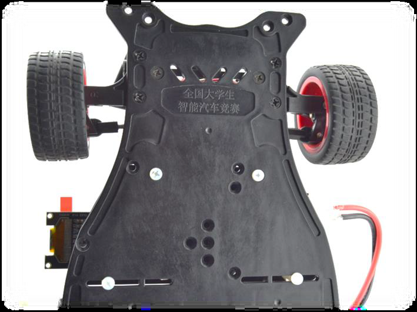

# Board Mounting Holes

We have discovered that only two of the mounting holes may line up correctly on the ALAMAK frame.

* [ ] This board was originally designed for the Laandzo model B and C frames which have since been replaced by the ALAMAK model
* [ ] \<ToDo: add picture here>
* [ ] \<ToDo: review hardware and determine the course of action. Maybe two additional holes will need to be drilled. Provide instruction on how to do this?>

## On Landzo Model C the Power distribution board would mount using the holes shown below.

