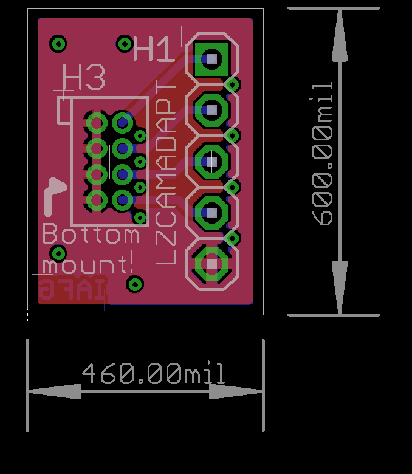
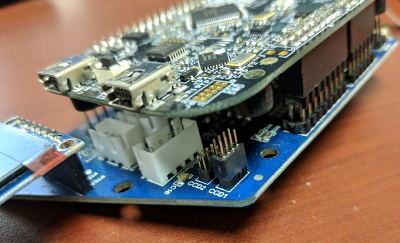

# \[Deprecated\] LZCAMADAPT Camera adapter

\* **NOTE THIS BOARD IS NOT CORRECT** \*

 **Do not use. I was rushing and made a dumb mistake. See LZCAMADAPT2 for the correct version. The Correct board will have the silkscreen printed "LZCAMADAPT2"**

* [ ] NOTE: This is untested, but i think this version of the adapter board would allow the old \*original\* \(pre-alamak\) camera to work with this board.

A simple camera adapter board has been prepared to jumper from the original 5 pin 0.100" header/socket to the smaller 2x4 0.50" header/socket. Only "Version 2" camera module needs this adapter since the ribbon cable on "Version 2" already has the correct 0.50" connector, it just needs to be removed from **its own**  adapter board that converts to 5 pin.

* The board and schematic are available in EAGLE CAD format.

## PCB

The small adapter looks like this:

* [x] \(Image updated 2018.1.29 to show silkcreen as fabricated\)

## Schematic

Thee schematic is very basic. Just connects the pins as follows:

**Image 1:** The image above shows the socket \(connector\) installed on the camera pin header. Normally this would be soldered onto the PCB. This image was taken just as a check that it fit well.

**Image 2:** The image above shows a paper version of the CAMADAPT PCB and how the 5 pin connector would solder in place. The socket \(connector\) shown in **Image 1** should solder on the opposite side of this PCB

## Board Modification

If you really want to you can cut and jumper the traces to make it like CAMADAPT2. Below is a picture of something what this would look like when you are done.

