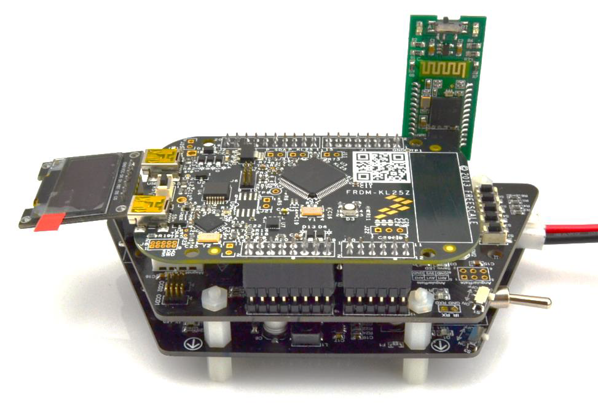

# 2017 TFC Hardware Overview

The 2017 hardware consists of two trapezoidal shaped boards \(System and Motor Drive\) and an NXP FRDM-KL25Z board.

Important notes:

* There are **optional** Bluetooth module and LCD module.
  * While the LCD module is provided as a bonus it is not needed for TFC cup
  * NXP does not currently have example code for it.
* * _NEED TO UPDATE THIS SESSION_ The FRDM-KL25Z sits **on top** of the board stack with **headers at the bottom**.
  * Recent changes to the FRDM kit means **Female socket headers are not provided** with the FRDM-KL25Z kit
    * This is a new discovery. We are working to resolve this. Check the community for discussion
  * It is **strongly recommended they be added**
    * You may choose to solder the FRDM-KL25Z directly to the top board, but that would make it very difficult to remove if/when you need to access the system board below.

## When fully assembled the board stack will look something like this \(Minus the LCD and BLE adapter\):

