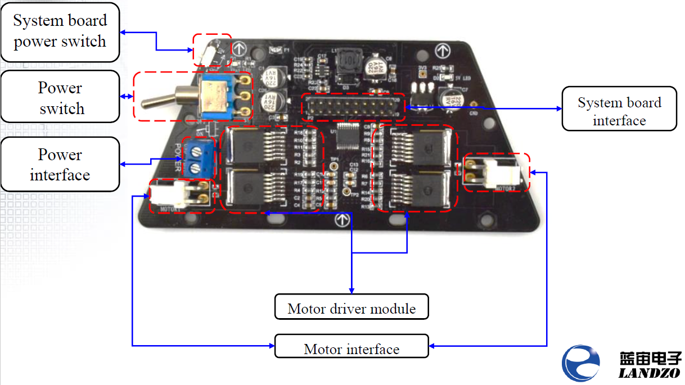

# Motor Driver Board

* [ ] &lt;ToDo: Clarify which motor is on what side. From the pictures, the top of this trapezoidal board is the FRONT, and therefore left and right become obvious. But we haven't shown an assembled car yet so there is a bit of questioning going on.

