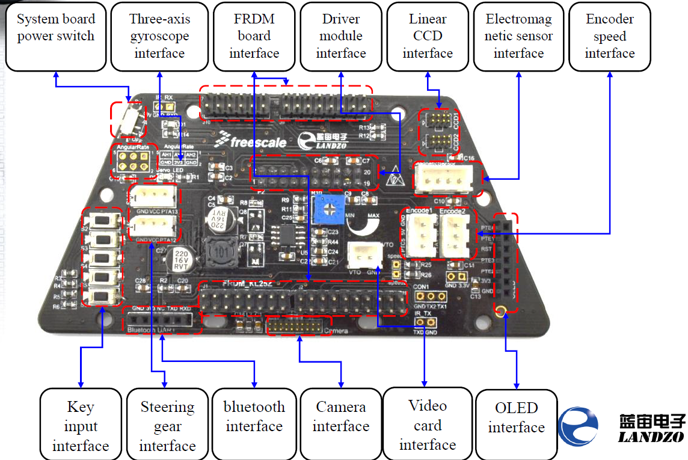

# System Board

PLEASE NOTE: Not all these interfaces are used or expected to be supported in the 2017 EMEA TFC Cup.

* The Camera interface used is CCD1
* The Steering Gear (Servo) used is SM1 
  * [ ] \<ToDo: Double check SM1 and not SM2>
* OLED interface is where LCD connects. Note this is a bonus part and not supported.

