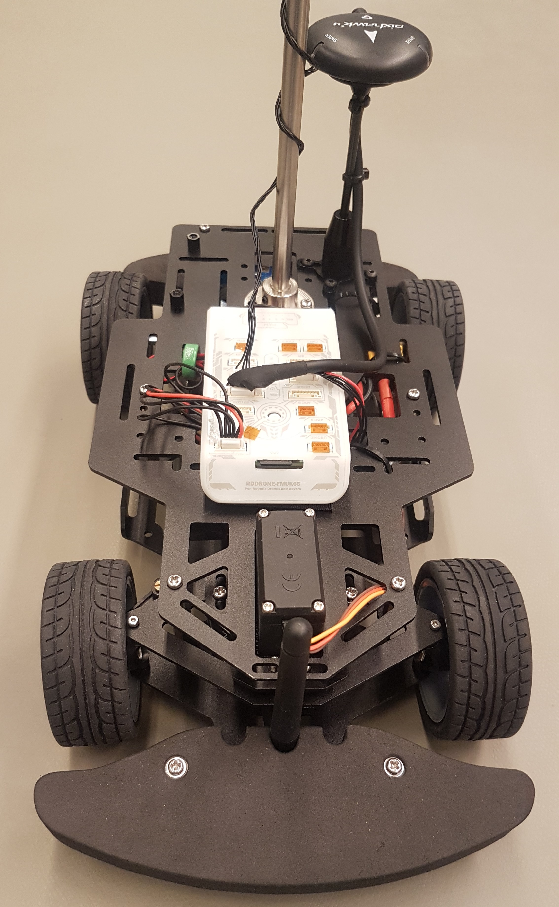

# RDDRONE-FMUK66

When you are using the FMUK66 you have to do the [FMU enclosure](https://nxp.gitbook.io/nxp-cup/developer-guide/assembly/rddrone-fmuk66/fmu-enclosure) first. Then you can continue with the [assembly of the FMU](https://nxp.gitbook.io/nxp-cup/developer-guide/assembly/rddrone-fmuk66/fmu-assembly) to the chassis.

