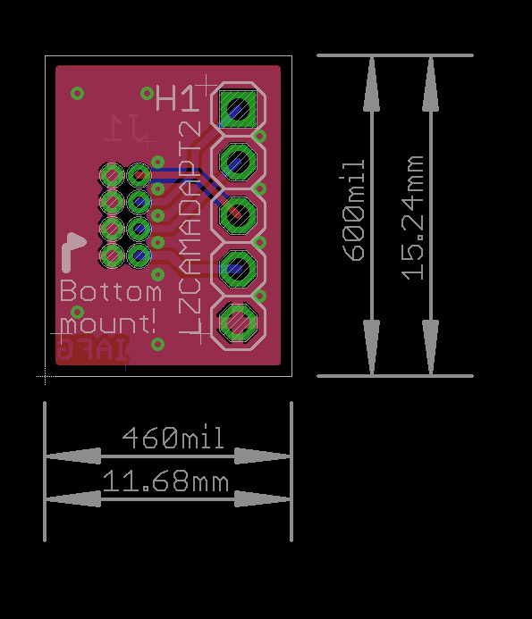
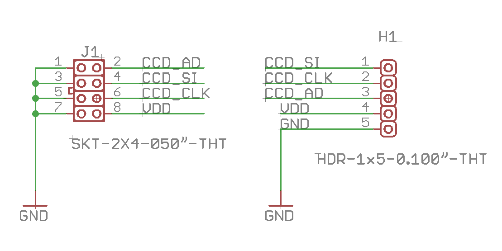

# LZCAMADAPT2 Camera Adapter

\*** NOTE THIS BOARD CORRECTS an error in LZCAMADAPT**\*

**I was rushing and made a dumb mistake. \*The board shown here\*, With "LZCAMADAPT2" printed on it is the correct version.**

A simple camera adapter board has been prepared to jumper from the original 5 pin 0.100" header/socket to the smaller 2x4 0.50" header/socket. Only "Version 2" camera module needs this adapter since the ribbon cable on "Version 2" already has the correct 0.50" connector, it just needs to be removed from **its own ** adapter board that converts to 5 pin.

* The board and schematic are available in EAGLE CAD format.

## PCB

The small adapter looks like this:

## Schematic

Thee schematic is very basic. Just connects the pins as follows:

(Note the J1 is a socket and has the same numbering, but ther reverse pin location from the PCB header)

**Image 1:** The image above shows the socket (connector) installed on the camera pin header. Normally this would be soldered onto the PCB. This image was taken just as a check that it fit well.

\<ToDo - insert picture here>

**Image 2:** The image above shows a paper version of the CAMADAPT2 PCB and how the 5 pin connector would solder in place. The socket (connector) shown in **Image 1** should solder on the opposite side of this PCB
