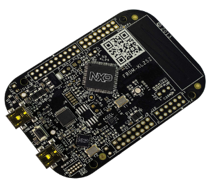
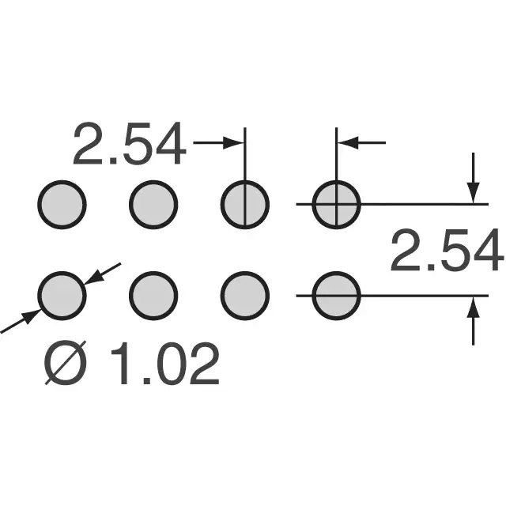

# FRDM Board Socket Headers

We have learned that the FRDM-K64 boards no longer ship with socket headers. This was not expected.

To attach the FRDM board to the trapezoidal System Board Dual row pin socket headers are needed. It is not recommended that you solder the FRDM directly to the System board pins as that would make it very difficult to service or access the System board.

Connectors needed are:

* 1x 12 Pin - 2 Row x 6 pin  0.100" Socket header
* 2x 16 Pin - 2 Row x 6 pin  0.100" Socket header
* 1x 20 Pin - 2 Row x 10 pin  0.100" Socket header

These socket headers follow the conventional 0.100"x 0.100" (2.54mmx2.54mm) pin spacing shown below

* [**An example of these components from Mouser**](https://www.mouser.com/Connectors/Board-to-Board-Mezzanine-Connectors/\_/N-ay0kr?P=1ytkls1Z1yvgchuZ1ytkn39Z1ytkn06Z1z0j1prZ1z0z5h6Z1z0wxp6Z1z0zlewZ1z0zlg8\&Keyword=2.54mm\&FS=True)

