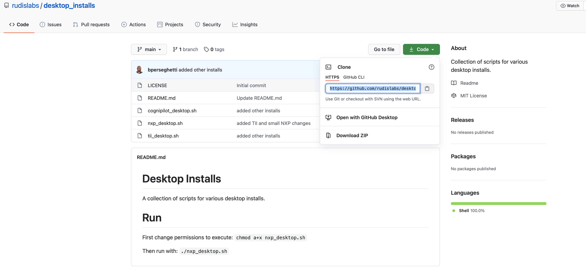

# Installation of NXP Gazebo


These are draft instructions and may change or be updated. Please check back here regularly.

If you run into issues with this guide, please use the `Contact` section in the sidebar on the left to get help.


## Setting up your Ubuntu desktop environment

You can install by using nxp\_desktop.sh shell by downloading the file at



You can do so easily by running the following git clone command using the link from the git repo:



```text
$ git clone https://github.com/rudislabs/desktop_installs
```

Now you should see the `desktop_installs` folder in your home folder:


After downloading the file you may need to make it executable. You can do so by entering the `desktop_installs` directory and running a `chmod` command:

```text
$ cd desktop_installs
$ chmod a+x nxp_desktop.sh
$ ls
```

Now you should see that the `nxp_desktop.sh` file is highlighted green. This means that it has executable permissions.


Now, we want to run this file to set up our desktop environment. It will ask you for your Ubuntu user password; just type that in when it asks for it. To run the file, run the following command and you should get the expected output:

```text
$ ./nxp_desktop.sh
```


You should now see that your background has changed and the command has given you the `All done!` signal. Great! Now let's run the workspace setup to get Gazebo, PX4, and ROS installed.

## Setting up NXP Cup Simulation software

### Running the ROS2 Foxy install script

First, we will need to navigate to the new workspace folder created by the `nxp_desktop.sh` install script. The workspace folder is at `~/git/`. Inside of that workspace folder, there is a script that will set up ROS2 and all necessary dependecies for you. That install script is located at `~/git/nxp_gazebo/scripts/`. To get there, run the following commands:

```text
$ cd ~/git/nxp_gazebo/scripts
$ ls
```


Now, we will need to run the `foxy_install.sh` file to set up our software. To start, run the following command and make sure you get the expected output:


Note: This command will take a long time to finish since it is installing ROS2. 


```text
$ ./foxy_install.sh
```


Once you get the expected output from `./foxy_install.sh`, you'll want to add a line to your `~/.bashrc`. Follow the instructions below:

```text
$ nano ~/.bashrc

[go to end of file]

Add: source /opt/ros/foxy/setup.bash

[Press ctrl+x, type Y, press enter]
```

Then, run the following commands and make sure you get the expected output:

```text
$ cat ~/.bashrc
$ source ~/.bashrc
```


### Installing RTPS

In order to transfer simulated Pixy camera data from ROS2 to simulated PX4, we need to install some software. We are following the guide at the link below, but we will go over the commands in detail here.



#### Installing Fast-RTPS \(DDS\)

Clone the project from Github:

```text
$ git clone --recursive https://github.com/eProsima/Fast-DDS.git -b v2.0.0 ~/FastDDS-2.0.0
$ cd ~/FastDDS-2.0.0
$ mkdir build && cd build
```

You should get the expected output from these commands shown below:


Next, we will run some commands to build and install Fast-DDS. Run the following commands:

```text
$ cmake -DTHIRDPARTY=ON -DSECURITY=ON ..
$ make -j$(nproc --all)
$ sudo make install
```

You should get a message stating `[100%] Built target fastrtps` once `make -j$(nproc --all)` is finished, and you should get the expected output shown below after you run `sudo make install`:


#### Installing Fast-RTPS-Gen

Next, we will install Fast-RTPS-Gen. To do so, run the following command and make sure you get the expected output:

```text
$ git clone --recursive https://github.com/eProsima/Fast-DDS-Gen.git -b v1.0.4 ~/Fast-RTPS-Gen \
    && cd ~/Fast-RTPS-Gen \
    && ./gradlew assemble \
    && sudo ./gradlew install
```


If you got the expected output, great! We will move on to building our ROS2 workspace.

### Building the ROS2 workspace

Now, we will want to navigate to the ROS2 workspace and build all of the packages inside it. First, we will change directories to the `~/git/nxp_ros2_ws/` and then run some build commands. Run the commands below and make sure that you get the expected output:

```text
$ colcon build --packages-select px4_msgs --symlink-install
$ colcon build --packages-select px4_ros_com --symlink-install
$ colcon build --packages-select nxp_cup_vision --symlink-install
$ colcon build --packages-select nxp_cup_bringup --symlink-install
```


Once we have built all of our ROS2 workspace, we will want to source the setup.bash for the workspace. We also want to make sure that all of our library paths are properly sourced. To do so, we will add some lines to the end of our `~/.bashrc`. Add the following lines to the end of your `~/.bashrc`:

```text
source /home/$USER/git/nxp_ros2_ws/install/setup.bash
export PATH=/usr/lib/ccache:$PATH
export GAZEBO_RESOURCE_PATH=/usr/share/gazebo-11
export GAZEBO_MODEL_PATH=/home/$USER/git/PX4-Autopilot/Tools/sitl_gazebo/models:/home/$USER/git/nxp_gazebo/models
export GAZEBO_PLUGIN_PATH=/usr/lib/x86_64-linux-gnu/gazebo-11/plugins:/home/$USER/git/PX4-Autopilot/build/px4_sitl_rtps/build_gazebo
export LD_LIBRARY_PATH=/home/$USER/git/PX4-Autopilot/build/px4_sitl_rtps/build_gazebo:$LD_LIBRARY_PATH
```

You can do so with `nano` or `vim`. You can follow the `nano` instructions from earlier in the guide if you need help doing so. To make sure your `~/.bashrc` looks correct, run the following command and then check if you get the expected output:

```text
$ cat ~/.bashrc
```


Now, you'll want to source that `~/.bashrc` by running the following command:

```text
$ source ~/.bashrc
```

Once you're done building your ROS2 workspace and sourcing the `~/.bashrc`, we will move on to building the PX4 binary for our simulation!

### Building the PX4 binary

The PX4 source code is located at ~/git/PX4-Autopilot. To build the PX4 source, we will want to change directories and run the build command for `px4_sitl_rtps gazebo`. This will give the ROS2 workspace a PX4 binary to run for our simulated NXP Cup car. Run the following commands to build PX4 and make sure you get the expected output:

```text
$ cd ~/git/PX4-Autopilot
$ DONT_RUN=1 make px4_sitl_rtps gazebo
```


If you get the expected output, stay vigilant! We only have one more command to run. We need to install `xterm` for the PX4 shell that runs when we boot up the simulation. To do so, run the following command:

```text
$ sudo apt install xterm
```

Once you have done that, you're finished setting up the NXP Cup simulation! Congratulations! We know that it is quite a sophisticated process at the moment, but we will work on improving the process in the future. Stay tuned for updates to this page. In the meantime, if you have any issues, make sure to contact us using the contact page on this Gitbook:



Next, we will move on to running the Gazebo simulation for the first time to confirm that everything works correctly.

## Running the Gazebo Simulation

To run the Gazebo simulation, we suggest you first restart your VM or PC and/or log out and log back in. Once you've done so, you can run the following command to start the simulation stack and check to see if you get the expected result:

```text
$ ros2 launch nxp_cup_bringup nxp_cup_race.launch.py
```


Hooray! You have successfully setup your NXP Cup Gazebo Simulation. For more documentation on how to use the Gazebo simulation, move on to the next section using the buttons below or navigate by using the sidebar on the left.

