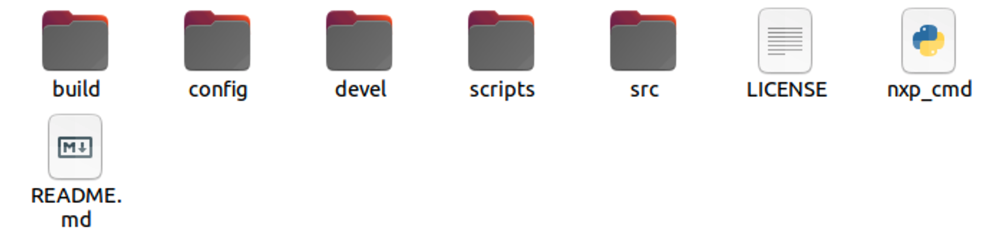

# Overview of the NXP Gazebo stack

## Outline of the stack

The NXP Gazebo simulation stack uses a diverse set of software to enable the simulation of the Cup car. Thankfully, as NXP Cup contestants, you will only need to use specific portions of the stack to develop your self-driving software. The stack is set up as follows:

An outline of the stack is found in the table below:

| Folder | Purpose | Relevant for development? |
| :--- | :--- | :--- |
| `build` | The `build` folder contains build files for the NXP Cup Gazebo simulation. This is a ROS1 build folder.  | No |
| `config` | The `config` folder contains one file for outlining git repositories the source files should be pulled from. | No |
| `devel` | The `devel` folder contains ROS1 specific packages and configuration files. | No |
| `scripts` | The `scripts` folder contains scripts for setting up the build environment. | No |
| `src` | The `src` folder contains the source code for the PX4 firmware and Gazebo 3D models.  | **Yes** |
| `LICENSE` | The `LICENSE` file contains open-source licenses for the software. | No |
| `nxp_cmd` | The `nxp_cmd` file is used to configure, update, and build the stack. | **Yes** |
| `README.md` | The `README.md` file currently does not contain any relevant information, but will be updated in the future to provide information about the NXP Gazebo simulation stack. | No |

### Writing code for the stack

To write code for the stack, you must be familiar with how PX4 runs modules. A brief overview will be be outlined in this section. We will be going over the `src` directory specificially.

In the source directory, you will see the following folders:

To develop your self-driving code, you'll want to navigate to the Firmware directory. This directory contains the PX4 firmware. A look inside the Firmware directory is below:

While there is a large amount of files and folders inside the `Firmware` directory, there is only a single location that you need to use. The location is in the `~/git/nxp_ws/src/Firmware/src/examples` directory. This directory contains user-written and example modules for PX4. By placing your self-driving source code in this directory, you can easily add it to the PX4 SITL \(Software In The Loop\) build target. Thankfully, we have already included a simple example module that drives the simulated cup car around an oval track. The module is located at `~/git/nxp_ws/src/Firmware/src/examples/nxpcup/`. An overview of the directory is located below:

Inside of the `nxpcup` directory, you will see a few files that may look familiar if you have previously used a brushless NXP Cup car kit. The files here are provided for contestants to get a quick start with simulation. A description of each file is in the table below:

| File name | Description |
| :--- | :--- |
| CMakeLists.txt | Tells cmake what files to compile for this module. This does not need to be changed unless you add extra source files. |
| nxpcup\_start.cpp | This file starts a thread that runs the simulated NXP Cup car. Code here does not need to be changed.  |
| nxpcup\_start.h | Header file for the nxpcup\_start.cpp file. Does not need to be changed. |
| nxpcup\_race.cpp | This file contains the self-driving source code. This is the file that you will use to develop your self-driving algorithms.  |
| nxpcup\_race.h | Header file for the nxpcup\_race.cpp file. If you add functions, structures, or other code that needs to be contained in a CPP header file, you will put that code here. |

### Overview of the example code

Inside of `nxpcup_race.cpp`, there is a method that receives vector information from the a simulated Pixy camera and returns speed and steer values. The vector information is received through a uORB topic and is nearly identical to the vector information sent by the Pixy over I2C. 


At the moment, only up to two vectors are published to the uORB topic the example code subscribes to. In the future, we plan to support more than two vectors as well as intersection data so that the simulated Pixy cam is a 1-to-1 replacement in the code.


The source code uses a simple algorithm to extract speed and steer values from the supplied vector data to drive the car. We expect contestants to improve upon this algorithm and show us how fast their simulated NXP Cup car can go! 

## Next steps

In the next section, we will outline the steps to running this example code. Please follow the navigation at the bottom of the page or use the menu to the left.

