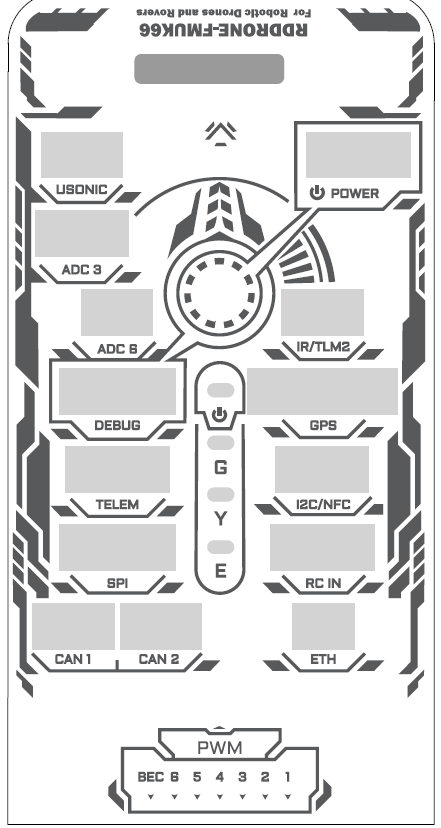

# FMU Connectors and pinout

## RDDRONE-FMUK66 Rev. C connectors

RDDRONE-FMUK66 Rev. C uses the new 10 pin connector for the Holybro GPS module. That GPS module incorporates the arming button and LED, as well as the beeper and an RGB high intensity LED.

.png>)

## Connector pinout

Each connector pinout can be viewed on the schematics. There may also be pages here that show the pinout table and (a part of) the schematic of the connector. Some pages also include additional information relevant to the exposed interfaces. The connector specific pages are listed under this page.
